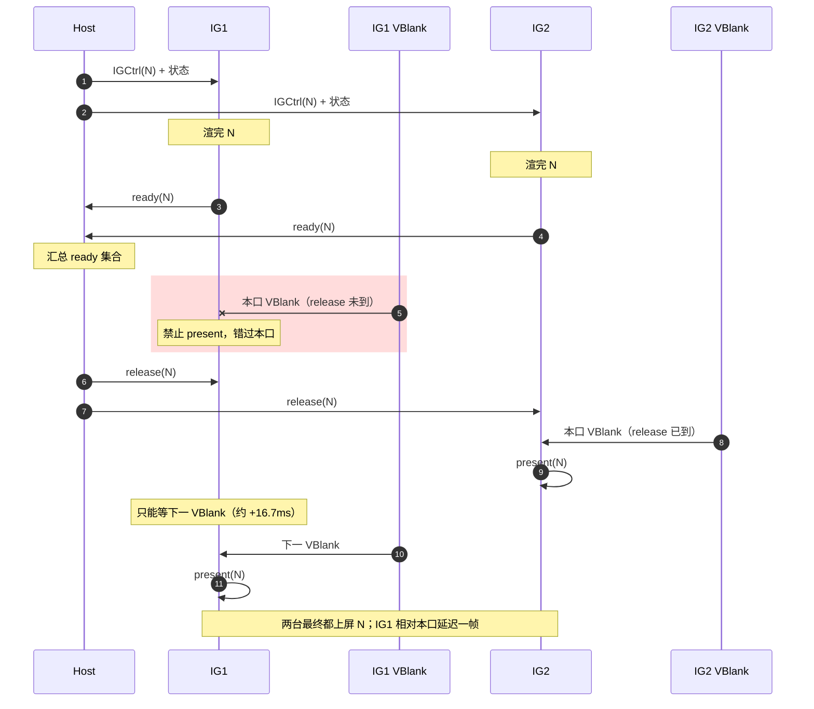

# 帧同步设计

面向本项目 **1 Host + 多 IG（约 10 通道）** 的 Present 对齐初步方案。知识见 [帧同步总结.md](../../notes/帧同步总结.md)。CIGI Message Sync（报文节拍）知识见 [状态同步总结.md](../../notes/状态同步总结.md)，设计见 [状态同步设计.md](./状态同步设计.md) §3。仿真时间消费见 [时钟同步方案.md](./时钟同步方案.md)。

**初步方案一句话**：软件 Present Barrier（逻辑帧 = Host Frame Number → 渲完 → 等齐 → Present）；**不把 SOF 当 Barrier**。节拍（FreeRun / SofGated）由状态同步设计初始化选定，与 Barrier 开/关正交。硬件 Swap/Framelock 后期。

**与 CIGI ICD §4.2 的关系**：§4.2 是报文节拍，**不是**本文的 Present 帧同步。SOF 在帧**开头**；Barrier 在渲**完**。统一 Host 帧号扇出不依赖 SofGated。

---

## 目录

1. [范围、实现状态与目标](#1-范围实现状态与目标)
2. [方案总览](#2-方案总览)
   - [2.1 时序对照](#21-时序对照)
3. [软件 Present Barrier（初步，未实现）](#3-软件-present-barrier初步未实现)
   - [3.1 逻辑帧](#31-逻辑帧)
   - [3.2 集合点](#32-集合点)
   - [3.3 超时与掉帧（待标定，实现前写死规则）](#33-超时与掉帧待标定实现前写死规则)
   - [3.4 Engine 挂钩（待实现）](#34-engine-挂钩待实现)
   - [3.5 UDP 同号连发](#35-udp-同号连发)
   - [3.6 耗时与适用条件](#36-耗时与适用条件)
4. [与 Message Sync 的边界](#4-与-message-sync-的边界)
5. [落地顺序](#5-落地顺序)
6. [验收要点](#6-验收要点)
7. [不做与扩展位](#7-不做与扩展位)
8. [与实现关系](#8-与实现关系)

---

## 1. 范围、实现状态与目标

### 1.1 节拍前提（不在本文实现）

数据面 Message Sync 见 [状态同步设计.md](./状态同步设计.md) §3.1：缺省 FreeRun **已实现**；SofGated **待实现**。模块设计 §9 P1「等齐所有 IG」不是 SofGated，也不是 Present Barrier。

### 1.2 帧同步实现状态（写死）

| 项 | 状态 |
| --- | --- |
| 同一 Host Frame Number 扇出全体 ready IG | **已实现**（`outMsgWithIgCtrlUdp` 数据面计数器；`CIGI-frame-cntr` / `CIGI-multi-ig`） |
| 软件 Present Barrier（渲完 N 等齐再 Present） | **未实现** |
| UDP 同号连发（§3.5） | **未实现** |
| 硬件 Swap Group / Swap Barrier | **未实现** |
| Framelock / Genlock（显示相位） | **未实现**（模块设计 §9 P2；属显示同步） |

### 1.3 纳入 / 暂不纳入


| 纳入初步 | 暂不纳入 |
| --- | --- |
| 软件 Present Barrier（§3）；FreeRun 与 SofGated 都能当上游 | 运行时热切 Message Sync（须重启 Host；节拍属状态同步设计） |
| 逻辑帧钥匙 = IGCtrl **Host Frame Number** | 用 SOF / IG Frame Number 当 Present 钥匙 |
| 掉帧策略：超时后的降级（规则见 §3.3，细则待标定） | 硬件 Swap Group/Barrier、Framelock、投影机 Genlock |
| 集合点由 **Host 汇总 ready 再放行** | IG 全互连 mesh Barrier；等齐**所有** IG 的 SOF 再发 |
| UDP 同号连发（§3.5）：IGCtrl / SOF / `ready` / `release` | 这四类改走 TCP；停等 ACK / 超时后再重发 |
| 帧预算有空档才开软件 Barrier（§3.6） | update+render 已贴满 60fps / 偶发掉帧时仍开软件 Barrier |


**目标**：拼接非严格时，各通道 Present 的逻辑帧号一致；跨机 Present 时刻差可到数 ms（软件上限）。不追求同一 VSync 沿。软件 Barrier 用额外延迟换同号；**帧预算贴满时不要开**（§3.6）。对比「只有节拍」与「节拍 + Barrier」时一次只动一个旋钮（节拍键在状态同步设计）。

---

## 2. 方案总览

```text
hostConfig.messageSync 在 Host initialize 钉死（状态同步设计 §3.1）
  freeRun   → 调用方定时器驱动发 IGCtrl(N)
  sofGated  → 等到 master SOF 再发 IGCtrl(N)
Host 扇出 IGCtrl(N) + 状态                 同一 N，两种模式都如此
各 IG 按 N 更新并渲染
各 IG ready(N) → Host 汇总                 软件 Barrier（§3，未实现；与 messageSync 正交）
Host release(N) → 各 IG Present            仍跟各自 VSync
（可选，后期）Swap Group/Barrier + Framelock
```

与已有层的边界：

| 层 | 文档 | 本层要不要重做 |
| --- | --- | --- |
| 报文节拍 | 状态同步设计 §3 | Barrier **不**改节拍键 |
| Timestamp / `simTimeUs` | 时钟同步方案 | 否；两种节拍都继续 `TimeStampValid=true` |
| 眼点 / 实体 | 状态同步设计 | 否 |
| 显示相位 | 模块设计 §9 P2 | 否 |

### 2.1 时序对照

两图都画 **Host + 两台 IG**。VBlank 是各机自己的扫描回扫，相位不必相同。`present(N)` 在 FIFO 下仍要等本机下一次 VBlank 才真正换缓冲。

#### 无软件 Barrier（现行 FreeRun 扇出）

各 IG 渲完就 `present`，不等其它通道。快的先上屏 N，慢的仍亮 N−1，接缝上有一段错帧窗口。

```mermaid
sequenceDiagram
    autonumber
    participant Host
    participant IG1
    participant VB1 as IG1 VBlank
    participant IG2
    participant VB2 as IG2 VBlank

    Host->>IG1: IGCtrl(N) + 状态
    Host->>IG2: IGCtrl(N) + 状态
    Note over IG1: 渲完 N（较快）
    VB1->>IG1: 本口 VBlank
    IG1->>IG1: present(N)
    Note over IG1,IG2: IG1 已上屏 N，IG2 仍显示 N-1（错帧）
    Note over IG2: 仍在渲染 N
    VB2->>IG2: 本口 VBlank
    IG2->>IG2: present(N)
```



#### 有软件 Barrier：IG1 的本口 VBlank 早于 `release`

两台都渲完并 `ready(N)` 之后才放行。**IG1 的本口 VBlank 落在 `release` 到达之前**：此时还不能 `present`，本口作废，只能再等下一 VBlank（约 +16.7ms @ 60Hz）。IG2 的 VBlank 更晚，赶上了 `release`，本口就能上屏 N。两台最终都是 N，但 IG1 相对「本口」晚了一帧。这是 §3.6 代价 1。



`release(N)` 只表示可以申请上屏 N，不是全体同一口 VBlank。IG2 赶上本口、IG1 落到下一口时，跨机 Present 时刻仍可差约一帧，这是软件 Barrier 的上限，不是硬件 Swap Barrier。

---

## 3. 软件 Present Barrier（初步，未实现）

### 3.1 逻辑帧

- **写死**：渲染/Present 对齐用的帧号是 Host→IG `CigiIGCtrlV4` 的 **Host Frame Number**（一次 `flushUdp` 对全体 ready IG 相同）。
- IG 自己的 SOF `IG Frame Number` 只用于回显/丢包观察，**不**作为 Present 钥匙（CIGI 3.2 起两套帧号独立）。

### 3.2 集合点

**写死**：

1. Barrier 发生在 **渲完 N 之后、Present 之前**。
2. **禁止**用 SOF 表示 ready(N) 或 release(N)。SOF 是帧起始心跳（现行无连发：每条 IGCtrl 回一条；同号连发落地后按 Host Frame Number 去重，§3.5）。SofGated 下 master SOF 只门控 **Host 发下一包**（状态同步设计 §3.1）。
3. CIGI 标准包**没有** Present ready/release；初步走 **UDP 同步面**上的自建 `sync_proto` 或注册 Extension Packet（与高频 IGCtrl 同面）。**不**改走 TCP（队头阻塞，见 [socket总结.md](../../notes/socket总结.md)）。丢包：同号连发降丢包率（§3.5）；仍可丢，跟下一帧或 §3.3 超时。**禁止**停等 ACK 再重发。

**初步（待实现）**：各 IG 渲完 N 后向 Host 发 `ready(N)`；Host 在已 ready 的 peer 集合上都收到 N（或触发 §3.3）后扇出 `release(N)`；IG 收到后再 `Present`。

未参与本帧的 peer（未连上、已摘除）不进入集合。与模块设计 §9 P0 断线摘除的衔接实现时再钉。

### 3.3 超时与掉帧（待标定，实现前写死规则）

软件 Barrier 必须有超时，否则一台卡住则全组永不 Present。候选（**尚未拍板**，实现前在本文钉一条）：

- 超时后：未 ready 的通道 **重复上一帧** 或 **跳过 N 跟 release 已就绪的最大帧**；
- 与时钟方案外推冻结独立：时间可继续走，画面帧号可以丢/重。

### 3.4 Engine 挂钩（待实现）

与现行 `Engine::tickOnFrame`（`preFrame` 收包 → `update` 写相机 → `render` → `postFrame`）对齐时：

- 收 `IGCtrl(N)` / 状态：仍在 `preFrame` / `update`（不变）。
- 现行 `Engine::render`：`recordAndSubmit` → `present` → `waitForFences`。Barrier 必须拆成：`recordAndSubmit` → **`waitForFences`（GPU 画完才算渲完）** → `ready(N)` → 等 `release(N)` → **`_viewer->present()`**（没有第二种换缓冲 API；`release` 不是 VBlank 脉冲）。
- 不得在 `preFrame` 用「本帧是否收到 SOF/IGCtrl」代替 ready。
- 等 `release` 期间不要开下一帧的 `recordAndSubmit`。超时后本帧已画进 swapchain 的，通常仍 `present()` 这一张。

耗时与何时不要开见 §3.6。

### 3.5 UDP 同号连发

**问题**：IGCtrl / SOF / `ready(N)` / `release(N)` 都走 UDP，没有传输层重传。停等对端回复、超时再补一枪，RTO 往往长过一帧，等于把队头阻塞请回来。改走 TCP 同样会堵（见 §3.2 / socket总结）。

**写死**：

1. 四类报文都留在 **UDP 同步面**。用 **同号连发**（盲目冗余）：同一份已打包数据报连续 `sendto` 多次，**不**递增帧号，**不**等 ACK。
2. 这是发送层重复，不是组包层塞多个 IGCtrl。帧头去重（同轮多次 `outMsgWithIgCtrl*` 只填一次头、一次 `flush` 一个 IGCtrl）语义不变；连发发生在 **flush 得到的那份数据报之后**。
3. 收端按帧号去重、幂等：先到的算数，后到的同号丢弃（IGCtrl 同号仍刷新时钟基准，见 [时钟同步方案.md](./时钟同步方案.md) §4.1 / `CLK-same-frame`）。
4. 连发只降独立丢包率，**不替代** §3.3 超时。三份一起没了（突发拥塞、断线）仍走超时 / 掉帧。
5. **禁止**「发一次 → 等回复 → 超时再发」作为这四类的主路径。
6. **与时钟方案 C 互斥（写死）**：§3.5 连发是**同一份快照**（帧号、`TimeStamp`、眼点都不改）。时钟方案 C 是同 `frameCntr` 但**刷新时间戳/眼点**，让各 IG 补偿后的 `simTimeUs` 更贴 Host「现在」。Present Barrier 的 N 必须是一份可对齐的快照：Barrier **开启**时不得走方案 C。只要「同一逻辑帧号、时间特效差一点也行」，可只开 C、不开 Barrier。现行 FreeRun 是每拍**新号 + 新戳**，无此冲突。Shader 应消费补偿后的 `simTimeSec`（时钟同步方案 §4.0），不要把原始 `IGCtrl.TimeStamp` 烤进 GPU。

**待标定**（实现前钉死数字，可按实测改）：每份 **3 次**；两次之间隔 **100～200 µs**。背靠背连打容易同一阵拥塞里一起丢，必须留间隔。允许收成 2 次，但不要默认 1 次。

| 报文 | 连发什么 | 收端 |
| --- | --- | --- |
| **IGCtrl** | 同一 Host Frame Number 的数据报 3 次（号不往上加）。**不是**时钟方案 C（C 同号改戳，与 Barrier 互斥，见上条 6 / 时钟同步方案 §5）。 | 同号 `>=` 接受；§3.5 副本戳相同，只刷新 `lastReceivedAtUs`。现状 drain **来一条回调一次**，连发会回调多次——画面仍末次生效。 |
| **SOF** | 组包一次后同一 IG Frame Number 连发。因 IGCtrl 副本进入 drain 时：**只在新的 Host Frame Number 上回一条 SOF**（与时钟方案 §5.1 第 3 条节流同一条）。SofGated 只认 master 该心跳的 **第一份**。 | 同号刷新 last-seen，不重复开门。 |
| **`ready(N)`** | 渲完后连发 3 次。 | Host 集合里第一次 `ready(N)` 算齐；重复忽略。 |
| **`release(N)`** | 集齐（或超时）后连发 3 次。 | IG 第一次 `release(N)` 才 Present；重复不得再 Present。 |

IGCtrl 同号重发与眼点绑定、SOF 节流的约束本就写在时钟方案 §5.1；本节只钉 **Barrier 相关四类** 的投递策略。现行数据面仍是每帧 `flush` 一次、无连发。

### 3.6 耗时与适用条件

`ready` / `release` 是渲完之后、Present 之前的额外 UDP 来回，**不加重这一帧的 update+render**，但吃掉「GPU 画完 → 本机下一 VBlank」的空档。

```text
最慢那台 GPU 画完  +  ready 上行  +  Host 汇总  +  release 下行  +  再等自己的下一次 VBlank
```

局域网顺时大约 **0.5～3ms**（未在本仓库实测）。FIFO 下 `_viewer->present()` 仍等 **本机** VSync；`release(N)` 只表示可以申请上屏 N，不是全体同一口 VBlank。

**写死的代价**：

1. **错过本口 VBlank**：16.7ms 预算里多这几毫秒，就可能再等一整拍。偶发掉帧会被放大成整组掉到约 30fps（连着两次 VBlank 才换一缓冲）。时序见 §2.1 第二张图（IG1 的本口早于 `release`）。
2. **一人掉帧、全墙空等**：一台没 `ready(N)`，其它通道不得先 Present N（`PRES-wait-slow`）。屏幕继续亮 N−1。超时才按 §3.3 降级。
3. **端到端更晚**：快通道渲完也要堵在 Present 门口，输入到上屏变长。

**何时不要开（写死）**：各 IG 的 update+render 已经贴着目标帧时（例如 60fps 跑满、还偶发掉帧）。此时用软件 Barrier 换同号，通常得不偿失。同一 Host Frame Number 扇出（已实现）可以继续；要接缝亚 ms，走后期硬件 Swap Barrier + Framelock，不要用 UDP 栅栏硬扛。

**何时可以开**：渲完到 VBlank 还经常剩出大于 `ready/release` 预算的空档（初步：slack 的低分位 **大于 2～3ms**，实现前按实测钉），且偶发掉帧很少。

**怎么量 slack（实现 Barrier 前先做）**：测量顺序与 §3.4 相同，先 fence 再 present（现行 `present` 在 fence 前，量不准「渲完」）。开发前全套基线见 [多通道同步验收测量设计.md](./多通道同步验收测量设计.md)。

```text
t0  recordAndSubmit 返回
t1  waitForFences 返回     ← GPU 画完
t2  present() 返回         ← FIFO 下通常已等到这次 Present 对应的 VBlank
slack = t2 − t1
```

连采数百～上千帧看 p50 / 低分位 / 最小值。整圈 `_lastFrameSeconds` 分不清哪些是在等 VSync，不能单靠它决定。窗口模式可用 `DwmGetCompositionTimingInfo` 的 `qpcVBlank` 对照；独占全屏不一定准。

---

## 4. 与 Message Sync 的边界

节拍配置、SofGated 流程、`MSYNC-*` 验收 **不在本文**，见 [状态同步设计.md](./状态同步设计.md) §3 / §10。知识见 [状态同步总结.md](../../notes/状态同步总结.md)。

本文只钉：Barrier 与 `messageSync` 正交；SOF 不得当 Present ready；两种节拍都能当 Barrier 上游。

---

## 5. 落地顺序

1. **现在**：默认 FreeRun。SofGated / 软件 Barrier 开发前先做 [多通道同步验收测量设计.md](./多通道同步验收测量设计.md)。上 Barrier 前按 §3.6 量 slack；贴满 60fps 则不要开。
2. **SofGated**：状态同步设计 §3.1；缺省不变。
3. **后期**：硬件 Swap Group/Barrier；拼接墙再加 Framelock，投影机独立时序再加 Genlock。

Barrier 与 SofGated 可并行开发，互不阻塞。

---

## 6. 验收要点

对照尚未落地的用例。对齐 [测试用例书写规范.md](../../测试用例书写规范.md)。Present 用 **`PRES-*`**。Message Sync 配置用 **`MSYNC-*`**（登记在 [状态同步设计.md](./状态同步设计.md) §10，避开 TCP 分帧 `FRM-*`）。

> 一经分配不改号、不复用、不重排。未写用例的码表示尚未落地。

| 码 | 场景 | 形式 | 验收 | Catch2 | 状态 |
| --- | --- | --- | --- | --- | --- |
| `PRES-same-n` | 同逻辑帧上屏 | 注入 / e2e | 一次扇出后，参与 Barrier 的各 IG Present 的 Host Frame Number 相同 | `[acceptance][bdd][sync][present][PRES-same-n]` | 未写 |
| `PRES-wait-slow` | 慢通道拖全组 | 注入 | 一台未 ready(N) 时，其它通道不得先 Present N | `[acceptance][bdd][sync][present][PRES-wait-slow]` | 未写 |
| `PRES-no-sof` | SOF 不是 Barrier | 注入 | 仅有 SOF、无 ready/release 时，不得当作放行 Present | `[unit][sync][present][PRES-no-sof]` | 未写 |
| `PRES-on-freerun` | 不等 SOF 也能 Barrier | e2e | Host FreeRun 下 Barrier 仍能对齐 N | `[acceptance][bdd][sync][present][e2e][PRES-on-freerun]` | 未写 |
| `PRES-on-sofgated` | SofGated 下 Barrier | e2e | `messageSync=sofGated` 时 Barrier 仍按 N 等齐 Present，不用 SOF 当 ready | `[acceptance][bdd][sync][present][e2e][PRES-on-sofgated]` | 未写 |
| `PRES-timeout` | 超时降级 | 注入 | 超过阈值后按 §3.3 已钉规则降级，不得死等 | `[acceptance][bdd][sync][present][PRES-timeout]` | 未写（依赖 §3.3 拍板） |
| `PRES-dup-n` | 同号连发去重 | 注入 | 同一 N 的 `ready`/`release` 连到多次，只计一次；不得因副本二次 Present | `[unit][sync][present][PRES-dup-n]` | 未写 |

现有 `CIGI-freerun` / `CIGI-frame-cntr` / `CIGI-sof-echo` 验收的是 **默认 FreeRun 的报文节拍 / 帧号扇出**（状态同步设计 §10），**不**验收 Present 对齐。

---

## 7. 不做与扩展位


| 项 | 状态 | 何时再加 |
| --- | --- | --- |
| 软件 Present Barrier（§3） | **待实现** | 拼接或通道间错帧可观察、且 §3.6 slack 够时 |
| 跑满目标帧率时仍开软件 Barrier | **不做** | update+render 贴满 / 偶发掉帧：见 §3.6；接缝要齐走硬件 |
| 运行时热切 Message Sync | **不做** | 节拍属状态同步设计；改配置重启即可 |
| 等齐**所有** IG SOF 再发 | **不做**（初步） | 模块设计 §9 P1；不要与 SofGated（单 master）混做 |
| 硬件 Swap Group / Swap Barrier | **不做** | 拼接墙 / 高等级视景 |
| Framelock / Genlock | **不做** | 显示同步；见模块设计 §9 P2 |
| IG mesh 互报 ready（无 Host 汇总） | **不做** | 无 Host 或 Host 不宜当集合点时 |
| PTP 作为 Present 对齐 | **不做** | 时钟层问题，见时钟同步方案 §7 |
| IGCtrl / SOF / `ready` / `release` 改走 TCP | **不做** | 队头阻塞；可靠投递不等于本帧按时到达 |
| 这四类停等 ACK / 超时后再重发 | **不做** | 用 §3.5 同号连发 |
| 软件 Barrier 与时钟方案 C 同时开 | **不做** | C 同号改戳破坏 N 快照；见 §3.5 第 6 条 |


---

## 8. 与实现关系


| 项 | 状态 |
| --- | --- |
| 同一 Host Frame Number 扇出 | **已实现**（节拍缺省 FreeRun，见状态同步设计） |
| `ready(N)` / `release(N)` / Present 等待 | **未实现** |
| UDP 同号连发（§3.5） | **未实现** |
| Engine 渲后挂钩 Barrier | **未实现** |
| Swap Group / Framelock API | **未实现** |


相关测试仍以默认 FreeRun 的节拍 / 状态 / 时钟验收码为准，直到本节 `PRES-*` 落地。`messageSync` / SofGated 状态见状态同步设计「与实现关系」。
