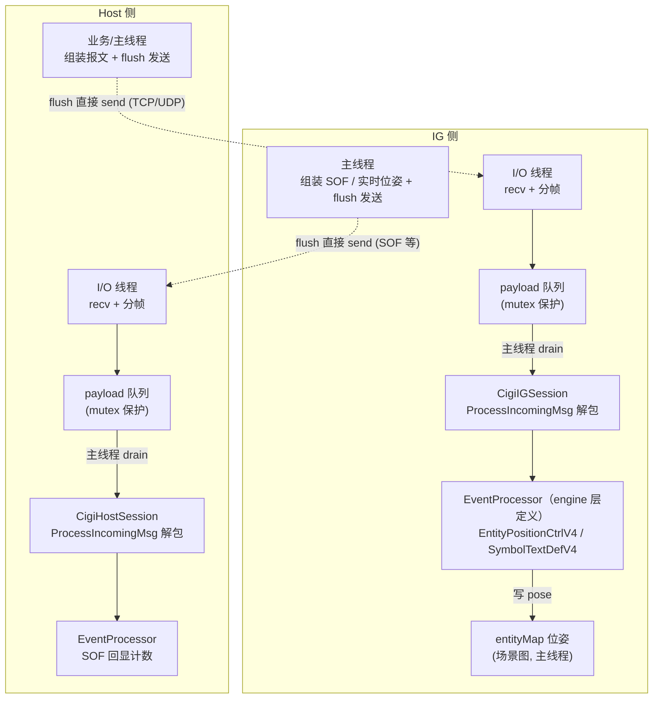

# 状态同步设计·初版（最小可用第一版）

> **本版为「最小可用第一版」**，当前要实现的版本。完整设计（QUERY 悬挂查询、cancelCommand、多 peer 并发等）见 [状态同步设计.md](./状态同步设计.md)（完整版，暂不实现）。

面向本项目 **1 Host + 多 IG** 的同步面设计：Host 通过 **TCP 命令面**一次性精准下发位姿摆放 / 文本指令，通过 **UDP 数据面**持续下发实时位姿；**无业务回执**。

**一句话**：命令/位姿用 CCL 标准报文下发，链路按语义选择（**持续下发走 UDP、一次性精准走 TCP**），**均 fire-and-forget、无业务回执**（TCP 靠传输层可靠、UDP 靠周期覆盖）；业务侧通过暴露的 `CigiOutgoingMsg` 引用批量组装报文后统一 `flush` 发送。

---

## 目录

- [状态同步设计·初版（最小可用第一版）](#状态同步设计初版最小可用第一版)
  - [目录](#目录)
  - [1. 范围与目标](#1-范围与目标)
  - [2. 架构分层图](#2-架构分层图)
  - [3. 时序](#3-时序)
  - [4. 报文与协议](#4-报文与协议)
    - [4.1 命令帧：`CigiEntityPositionCtrlV4` / `CigiSymbolTextDefV4`](#41-命令帧cigientitypositionctrlv4--cigisymboltextdefv4)
    - [4.2 TCP 分帧](#42-tcp-分帧)
  - [5. 传输通道](#5-传输通道)
    - [5.1 I/O 线程 + 主线程解包模型](#51-io-线程--主线程解包模型)
    - [5.2 断线检测](#52-断线检测)
  - [6. 执行模型：I/O 线程收字节 + 主线程解包执行](#6-执行模型io-线程收字节--主线程解包执行)
  - [7. Host 侧设计](#7-host-侧设计)
    - [7.1 API（引用式发送接口）](#71-api引用式发送接口)
    - [7.2 发送流程](#72-发送流程)
  - [8. IG 侧设计](#8-ig-侧设计)
    - [8.1 API](#81-api)
    - [8.2 收包流程](#82-收包流程)
  - [9. 配置与 API](#9-配置与-api)
  - [10. 验收要点](#10-验收要点)
  - [11. 不做与扩展位](#11-不做与扩展位)
  - [12. 与实现关系](#12-与实现关系)

---

## 1. 范围与目标

| 纳入初步 | 暂不纳入 |
|----------|----------|
| 命令帧（`EntityPositionCtrlV4` / `SymbolTextDefV4`）按链路下发 | QUERY / CMD_STATE 悬挂查询 |
| 链路选择：持续 → UDP，一次性 → TCP | cancelCommand / 在途集合 |
| TCP 分帧器（按 `PacketSize` 切流） | 多 peer 并发分发（串行即可） |
| 引用式发送接口（`tcpOutgoing`/`udpOutgoing` + `flush`） | 业务回执（ACK/NACK） |
| 收包入队 + 主线程执行 | 实体预加载（§11） |
| 断线检测 | — |
| **命令读循环线程 + 主线程执行**（见 §6） | — |

**目标**：跑通「Host 下发位姿/指令 → IG 收包执行」的闭环。

**关键认知（写死）：无业务回执。** 命令/位姿下发均 fire-and-forget，不做应用层 ACK/NACK：

- **TCP**：传输层保证字节不丢、保序、到达对端 socket——「精准送达」由 TCP 自身保证，无需应用层回执；
- **UDP**：靠周期覆盖自愈——丢一帧下一帧补上。

**链路选择规则（写死）**：所有 CIGI 报文在 TCP / UDP 两条链路上都支持发送，**具体走哪条链路由业务按语义判断**：

| 语义 | 链路 | 可靠性 |
|------|------|------|
| **持续周期性下发**（实时控制位姿，每帧覆盖） | UDP | 丢包自愈，无需确认 |
| **一次性、需精准送达**（摆放位姿、文本指令） | TCP | TCP 传输层可靠送达 |

**演进说明（写死）**：命令载体为 CCL 标准报文，**不新增自定义报文结构、不手写编解码与字节序**（唯一业务自建的是 §4.2 的 TCP 分帧器）。位姿用 `CigiEntityPositionCtrlV4`，通用文本指令用 `CigiSymbolTextDefV4`（`Text` 每次承载**一个**指令，但指令种类开放——几十种，`std::string` 上限 65528）。原「LOADMODEL/PLACEMODEL/MOVEMODEL + seq + RECEIVED/RESULT 两段回执 + `CigiIGMsgV4` 载荷」方案已否决（模型 IG 侧预加载、MOVE 无 CIGI 对应、业务回执删除）。

---

## 2. 架构分层图



> **关键分层（写死）**：
> - I/O 线程只 `recv` 字节入队，**不碰 CCL、不解包、不写场景**；
> - 主线程 `drain` 队列 → `ProcessIncomingMsg` 解包 → processor 写业务状态；
> - CCL（`Cigi*Session`）只在主线程触碰，天然单线程；
> - 发送（`flush`）由业务/主线程直接 `send`，不走 I/O 线程；
> - **processor 由 engine 层定义并注册**（sync 库只透传 `registerEventProcessor`），processor 直接写 `entityMap`。

---

## 3. 时序

```text
Host                                      IG
  │ tcpOutgoing() << EntityPositionCtrlV4 │
  │ flushTcp()                            │
  │ ───── TCP EntityPositionCtrlV4 ────▶ │  I/O 线程 recv → 入队 tcpPayload
  │  （无回执，TCP 传输层保证送达）        │  主线程 drain → ProcessIncomingMsg → processor 写位姿
  │                                        │
  │ udpOutgoing() << EntityPositionCtrlV4 │  （实时控制，每帧）
  │ flushUdp()                            │
  │ ═════ UDP EntityPositionCtrlV4 ═════▶ │  I/O 线程 recv → 入队 udpPayload
  │                                        │  主线程 drain → ProcessIncomingMsg → 实时更新位姿
```

---

## 4. 报文与协议

### 4.1 命令帧：`CigiEntityPositionCtrlV4` / `CigiSymbolTextDefV4`

> **消息结构（写死，CCL 强制，2026-08 实现阶段发现并修正）**：CCL 的 `CigiOutgoingMsg::PackageMsg`/`LockMsg` 要求 **Host 出站消息以 `CigiIGCtrlV4`（PacketID 0x0000）开头**，`CigiIncomingMsg::CheckFirstPacket` 要求 **IG 入站消息首包为 IGCtrl**，否则分别抛 `MissingIGControl`。因此命令面消息不能是「纯 `EntityPositionCtrlV4`/`SymbolTextDefV4`」，必须是 **IGCtrl 帧头 + 命令报文**：

```text
[IGCtrl(24B)][EntityPositionCtrlV4(48B)]                      // 摆放 / 实时位姿
[IGCtrl(24B)][SymbolTextDefV4(12B+Text)]                      // 文本指令
[IGCtrl(24B)][EntityPositionCtrlV4(48B)][SymbolTextDefV4(...)] // 批量多报文，单次 flush
```

`tcpOutgoing()`/`udpOutgoing()` 自动前置 IGCtrl 帧头（`_frameCounter` 递增、`TimeStampValid=false`），业务侧只 `<<` 命令报文。

**`CigiEntityPositionCtrlV4`（位姿）**：

```text
CigiEntityPositionCtrlV4（PacketID 0x01，48B，定长）
  EntityID    : uint16   // 目标实体
  ParentID    : uint16   // 父实体（Attach 时有效）
  AttachState : enum     // Detach=0 / Attach=1
  Yaw/Pitch/Roll : float // 姿态（度）
  Lat / Lon / Alt : double // Detach 时：纬度° / 经度° / 海拔 m
  Xoff / Yoff / Zoff : double // Attach 时：相对父实体 XYZ 偏移 m
```

**`CigiSymbolTextDefV4`（通用文本指令）**：

```text
CigiSymbolTextDefV4（PacketID 0x01d，变长：12B 头 + Text）
  SymbolID   : uint16   // 业务可用作命令编号（可忽略/置 0）
  Alignment / Orientation / FontID / FontSize : 显示字段（命令面不关心，取默认）
  Text       : std::string  // 空格分隔指令文本，UTF-8，每次承载一个指令
```

**指令编码（写死：空格分隔，首 token = 指令名，每次一个指令）**：

```text
Text = "<指令名> <参数1> <参数2> ..."
示例：
  "place 7 121.47 31.23 500"        // 指令名 place，参数：id lon lat alt
  "load teapot"                      // 指令名 load，参数：模型名
  "reset"                            // 指令名 reset，无参数
```

- **指令识别**：IG 侧对 `Text` 按空格切分，首 token 为指令名，据此分发到不同业务逻辑；指令集开放（几十种），由业务层定义，协议层不写死。
- **序列化**：`CigiOutgoingMsg << packet` 由 CCL `Pack` 生成报文，`Text` 由 `SetText` 维护长度与 8 字节对齐，字节序自动处理。
- **约束（写死）**：`Text` 为 UTF-8 文本、NULL 终止、按 8 对齐；**参数分隔不能使用 NUL 字符**（CCL `Unpack` 用 `strnlen` 截取，遇 `\0` 即截断），用空格等可见字符分隔。**第一版参数本身不含空格**（空格分隔下参数含空格会拆散解析），含空格参数（如带空格路径）的引号/转义规则留扩展位。
- **同报文双链路语义（写死）**：`CigiEntityPositionCtrlV4`（`0x01`）在 UDP（实时控制，持续覆盖）与 TCP（一次性摆放，精准送达）上语义不同——**靠收包来源（socket 链路）区分，而非 PacketID**（见 §5.1）。两者均无业务回执，区别仅在频率与可靠性。
- **数据面眼点 vs 命令面位姿的区分（写死，矛盾 A 后演进）**：数据面眼点（ownship `EntityID=0`）与命令面 UDP 位姿（业务 `EntityID≠0`）**共用同一 UDP socket**，且都是 `IGCtrl + EntityPositionCtrlV4` 结构。矛盾 A 后两者统一经 **同一个 IG CCL 会话**解包，区分由 processor 完成：
  - sync 库内部基础设施 `EyeCaptureProc` **只捕获 `EntityID==0`** 的眼点；
  - engine 注册的业务 processor（如 `EntityPlaceProcessor`）**必须按 `EntityID==0` 过滤**（ownship 保留给数据面眼点，命令实体从 `EntityID≠0` 开始）。
  若业务 processor 不过滤，数据面眼点会覆盖命令实体的 `entityId`（E2E 收发一致性断言 `entityId==7` 因眼点覆盖而失败的踩坑驱动此约定，2026-08）。早期实现曾用 IGCtrl `TimeStampValid` 分流（数据面=true / 命令面=false），矛盾 A 统一 session 后该机制已废弃。
- **双链路位姿冲突（写死：允许覆盖）**：同一 `EntityID` 可能同时被 TCP（摆放）与 UDP（实时控制）下发，**不区分管控方，谁后到谁生效**——IG 每收到一帧/一条就按最新值更新该实体位姿，TCP 与 UDP 之间无锁定、无优先级、无「接管」语义。业务侧自行保证不产生语义冲突（或接受覆盖）。

### 4.2 TCP 分帧

TCP 是字节流，CCL 的 `CigiIncomingMsg::ProcessIncomingMsg` 假设调用方喂入的是**完整报文**，不做拆包缓存。因此业务层需一个**最小分帧器**，它**只切边界，不编解码、不碰字节序、不定义报文结构**。**分帧器仅在接收端工作**——发送端用 `CigiOutgoingMsg::PackageMsg` 产出带 `PacketSize` 头的完整字节块，直接 `send`，无需分帧。

```text
CIGI V4 报文头（Pack 输出）：
  [PacketSize(2B)][PacketID(2B)][...载荷...]

命令帧（`EntityPositionCtrlV4` 定长 48B / `SymbolTextDefV4` 变长）——都靠头部 `PacketSize` 界定边界，分帧逻辑统一适用。

字节序（写死，CIGI 4 不强制）：CIGI 4（ICD §4.4）不强加字节序，接收方负责 swap。CCL 在 x86 上直接输出**小端**（`PackPointer.s` 直写）；两端同字节序（本项目 Host/IG 均为 x86）则无需转换。分帧器**不假设大端**，按 Packet Size 字段的字节序检测（左首字节为 0 = 大端，右首字节为 0 = 小端）切流。

分帧逻辑（消息级，写死）：
  1. 维护拼帧缓冲
  2. recv → 塞入缓冲
  3. 缓冲 >= 4B？→ 读首包 PacketSize + PacketID（按检测到的字节序）
  4. 首包必须为 IGCtrl（PacketID 0x0000）＝一条消息的开头；向后累积后续非 IGCtrl 包的 PacketSize，直到遇到下一个 IGCtrl 或数据不足
  5. 缓冲 >= 累计消息长度？→ 取完整一条消息 → 交给 CigiIncomingMsg::ProcessIncomingMsg
  6. 剩余继续（粘包/拆包都覆盖）

> 分帧粒度是「**消息**」（IGCtrl + 后续包），不是「单包」——`ProcessIncomingMsg` 的 `CheckFirstPacket` 要求首包为 IGCtrl，若按单包切，第二条起的非 IGCtrl 包会触发 `MissingIGControl`（实现阶段踩坑，2026-08）。
>
> **后续包 body 不完整时等待、不截断（写死，实现阶段修 bug）**：分帧器读到「后续包的头完整、但 body 未到齐」时，必须**等更多数据**（`messageLength` 返回 `nullopt`），不得把「首包 + 已到的部分」误切成一条完整消息——否则一条多包消息被 TCP 拆在包 body 中间时会截断丢包（`CigiFrameAssembler buffers a split message across feeds` 单测覆盖，2026-08）。「读不到下一个包头」时则乐观认为消息结束（命令面一条 flush 即一条消息，消息小、本地回环下极少恰好拆在包边界）。
```

> `ProcessIncomingMsg` 内部会按 `PacketID` 查表分发到对应 `EventProcessor`，无需业务逐包 switch。

---

## 5. 传输通道

### 5.1 I/O 线程 + 主线程解包模型

| 现状 | 缺口 |
|------|------|
| TCP 握手已通（HELLO/HELLO_ACK），连接保留在 peer 表 / `_tcp` | **已实现（命令面 + 数据面）**：命令帧改 CCL 标准报文 + 消息级分帧器（§4.2）；数据面（矛盾 A）已并入 CCL——Host 业务侧组装、IG 统一会话解包 |

> **实现进度（2026-08，矛盾 A + IG 数据面 I/O 线程化完成）**：
> - **Host 侧**：`HostSync::update` 已删除。业务侧（Engine `HostPosePublisher`）每帧 `udpOutgoing() << IGCtrl << 眼点`（经 `cigi_wire::appendHostFrame` 组装）→ `flushUdp()`；`udpOutgoing()` 只 `BeginMsg`、不再自动前置 IGCtrl。
> - **IG 侧**：数据面 + 命令面统一经同一 IG CCL 会话解包。**UDP 收包已拆到独立 I/O 线程**（`udpLoop`：非阻塞 `recv` → 过滤握手面 → 入队 `_udpPayloadQueue`，并在 recv 时刻记录 `receivedAtUs`）；主线程 `IgSync::update()` 只 **drain 队列 → `processIncomingUdp` 解包**（空队列按 1ms 步进等待最多 5ms 后再试，保证刚发到的数据报当帧可见）。sync 库内部注册基础设施 processor（`IgCtrlCaptureProc` 捕获帧号/时间戳、`EyeCaptureProc` 只捕获 ownship `EntityID==0` 眼点）；业务 processor 经 `registerEventProcessor` 注册。旧的 `TimeStampValid` 分流与 `dispatchCommandPlaneFrame` 已删除。
> - 遗留：Host 侧仍为「accept 线程 + udpLoop 线程」、IG 侧为「commandLoop（TCP）+ udpLoop（UDP）」两个 I/O 线程，尚未收敛到「单一 I/O 线程 select 多路复用」的最终形态（见下文目标模型）；`packHostFrame`/`unpackHostFrame` 保留为线格式测试锚定 helper，运行时不再使用。

**收发线程模型（写死）**：每端 **一个 I/O 线程**包办 TCP + UDP 两条链路的所有**接收**，**recv 字节 → 分帧 → 入队完整报文**（分帧器挂 I/O 线程，见 §4.2，只切边界、不碰 CCL、不解包）；解包统一在主线程。

```text
Host 侧：
  I/O 线程（一条，select 多路复用 TCP 各 peer + UDP + listen）：
    recv 字节 → 分帧 → 入队完整报文（tcpPayload / udpPayload 两队列）→ 不解包
  accept 线程：仅 accept 新连接，挂入 I/O 线程的 select 集合
  主线程：drain 完整报文 → CCL 解包（SOF 回显计数等）

IG 侧：
  I/O 线程（一条，select TCP + UDP）：
    recv 字节 → 分帧 → 入队完整报文（tcpPayload / udpPayload 两队列）→ 不解包
  主线程（帧循环）：drain 完整报文 → CigiIncomingMsg::ProcessIncomingMsg 解包 → 触发 processor → 执行
```

> **发送不走 I/O 线程（写死）**：`flushTcp()/flushUdp()` 由调用方（主线程/业务线程）直接 `PackageMsg` + `send`，I/O 线程只负责**收**。发送是主动、非阻塞、低频（命令面）或每帧（数据面，主线程本身驱动），无需发送队列。
>
> **分帧器归属（写死）**：TCP 分帧器（§4.2）挂 **I/O 线程**（持有 socket、天然维护拼帧缓冲），产出的是**完整报文**；主线程 drain 出的就是完整报文，直接喂 `ProcessIncomingMsg`。分帧器只切边界、不碰 CCL，与「I/O 线程不解包」不冲突。
>
> **CCL 单线程化（写死，架构收益）**：解包（`CigiIncomingMsg::ProcessIncomingMsg`）**只在主线程调用**，CCL 非线程安全问题从根上消除——不再需要「每链路一套会话」的隔离（此前 §5.1 的会话隔离因 I/O 线程解包而需要，现已无需）。CCL 会话按角色持有即可：Host 一套 `CigiHostSession`、IG 一套 `CigiIGSession`，均只在主线程触碰。
>
> **CCL 会话创建策略（写死，性能决策）**：`CigiSession` 构造/析构曾因 `CigiIncomingMsg` 内含 `EventList[0x10000]` + `CallBackList[0x10000]`（131072 个 `std::list`）在 MSVC Debug 下约 80ms/op；已将这两个数组惰性化为 `std::map`（仅实际注册/解包的 PacketID 分配 entry），构造/析构降到微秒级。会话因此**无需再为性能刻意推迟**：Host 在首次 `tcpOutgoing()/udpOutgoing()` 时创建（`ensureSession`），IG 在首次 `update()` 收包或 `registerEventProcessor` 时创建（`ensureSession`，同时注册基础设施 processor）。
>
> **I/O 多路复用（写死）**：一个 I/O 线程同时管 TCP（多 peer）+ UDP，需 `select`/`poll`/`WSAEventSelect`（Windows 用 `select` 或 `WSAEventSelect`）。Host 侧 peer 表增减时动态更新 select 集合。

### 5.2 断线检测

- I/O 线程是唯一 `recv` 者：读到 EOF（`recv` 返回 0）即判定断线，联动 `markDisconnected()`、摘除 peer、移出 select 集合；
- 物理断网（无 FIN/RST）时 `recv` 卡住，需 `recv` 超时或心跳兜底（[socket总结.md](../notes/socket总结.md) §5.1）；I/O 线程的 `SO_RCVTIMEO` 超时唤醒可作弱心跳，但静默断网仍依赖外部心跳（扩展位）。
- **第一版实现（写死）**：第一版即实现 `SO_RCVTIMEO` 超时唤醒（现有 `TcpSocket::setRecvTimeout` 已具备），超时视为「无数据」，循环继续；真正断网仍依赖外部心跳（扩展位）。

---

## 6. 执行模型：I/O 线程收字节 + 主线程解包执行

**第一版采用「I/O 线程只收字节入队 + 主线程解包 + processor 执行」**：

```text
IG I/O 线程（connect 成功后启动，独立线程，select TCP+UDP）：
  recv 字节 → 分帧 → 入队完整报文（tcpPayload/udpPayload）→ 不解包 → 处理下一段

IG 主线程（帧循环，SynchronSystem::update）：
  drain tcpPayload/udpPayload → CigiIncomingMsg::ProcessIncomingMsg 解包
    → 触发对应 EventProcessor.OnPacketReceived
    → processor 写 entityMap pose（场景图，主线程安全）
```

> **解包归主线程（写死）**：`ProcessIncomingMsg` + `EventProcessor` 全部在主线程调用。理由：processor 要写场景图（`transform->matrix`），场景图与 GPU 对象只允许渲染线程侧修改——独立执行线程改场景会与渲染遍历并发，实测崩溃（§6 实机崩溃驱动）。解包归主线程后，processor 天然可写场景，无需锁。
>
> **SOF 回显（写死）**：主线程 `drain` 后解包**每条 IGCtrl 即回一条 SOF**（帧号一一对应）。SOF 携带 `FrameCntr` 是**帧号回显**（丢帧检测用），不是低延迟心跳；主线程 60fps、Host 180fps 时一次 drain 可能回 3 条 SOF（帧号 N、N+1、N+2），**帧号不丢、计数正确**，仅到达 Host 时刻批量化——对帧号回显无害。Host 健康/断线判断靠 **TCP 断线检测（§5.2）+ UDP SOF 计数**，不依赖 SOF 到达频率。
>
> **读循环线程职责收敛（写死）**：I/O 线程只 `recv` 字节 + 分帧 + 入队完整报文，**不碰 CCL、不解包、不写场景**。断线检测并入 I/O 线程（§5.2）。
>
> **processor 分层（写死）**：每个 CIGI 报文一个 `CigiBaseEventProcessor`，processor 只做「捕获字段 + 写业务状态」（如 `EntityPositionCtrlV4` 的 processor 直接查 entityMap 写位姿）。与数据面 `Capture*Proc`（捕获字段）一致，业务逻辑收敛在 processor 内。

- 命令低频事件驱动，主线程每帧 drain 队列处理；
- 命令执行耗时取决于指令类型（place 微秒级、load 可能百 ms），执行归主线程、无回执，故不阻塞 Host 侧；
- 多 peer：Host 侧单 I/O 线程 select 管理所有 peer（替代「每 peer 一条读循环线程」）。

---

## 7. Host 侧设计

### 7.1 API（引用式发送接口）

业务侧**组装好 CCL 报文对象**，通过暴露的 `CigiOutgoingMsg` 引用批量写入，最后统一 `flush` 发送。**不再为每种报文提供专用发送方法**（避免每加一个报文就加一个接口）。

> **HostSync 无 `update` 方法（写死，已实现 2026-08）**：系统帧节拍（IGCtrl / 眼点）与实时控制位姿**均由业务侧（Engine）组装**进 `CigiOutgoingMsg`，`flush` 是唯一发送入口。业务侧每帧发送 = `udpOutgoing() << IGCtrl << 眼点 << 实时位姿` → `flushUdp()`；一次性命令 = `tcpOutgoing() << 报文` → `flushTcp()`。sync 层退化为纯传输管道，报文组装职责上移至业务侧。`HostSync::update` 已删除，`udpOutgoing()` 只 `BeginMsg`（不再自动前置 IGCtrl，业务侧用 `cigi_wire::appendHostFrame` 组装 IGCtrl+眼点），`tcpOutgoing()` 仍自动前置 IGCtrl 帧头（命令面消息头）。帧号经 `HostSync::nextFrameCntr()` 分配，`igCtrlSentCount()` = 已分配帧号数。

```text
// 命令面（TCP）：批量组装后统一发送（fire-and-forget，靠 TCP 可靠送达）
CigiOutgoingMsg& tcpOutgoing();   // 惰性 BeginMsg；业务侧 << 报文
void flushTcp();                   // PackageMsg + 发送到所有 ready peer + FreeMsg

// 数据面（UDP）：批量组装后统一发送
CigiOutgoingMsg& udpOutgoing();
void flushUdp();                   // PackageMsg + 发送到所有 ready peer + FreeMsg
```

业务侧示例：

```cpp
auto& tcp = host.tcpOutgoing();
CigiEntityPositionCtrlV4 place;
place.SetEntityID(7);
place.SetLat(31.23); place.SetLon(121.47); place.SetAlt(500.0);
tcp << place;                       // 可再 << 其他报文（批量）
host.flushTcp();                    // 统一 package + send
```

> **线程安全（写死）**：CCL `CigiOutgoingMsg` 非线程安全，`tcpOutgoing()/udpOutgoing()` 返回的引用**同一时刻只能被一个线程操作**；`flush` 完成一轮（`PackageMsg` + send + `FreeMsg`）后引用方可复用。
>
> **已知隐患 / 未来优化项（第一版不上锁）**：当前**未做并发保护**——仅靠「业务侧单线程发送」这一约定维持正确性（现状业务命令均由单一 UI/命令触发线程发出，无并发写）。若未来出现多线程并发发命令，`CigiOutgoingMsg` 内部状态（buffer 位置）与 socket 写会互相踩踏，需择一上锁（三方案见 §11）。

### 7.2 发送流程

```text
flushTcp() → void：
  1. PackageMsg 当前 tcpOutgoing 缓冲 → 字节
  2. 快照当前 ready IG 列表
  3. 对每个 ready peer：TCP 写字节（sendAll）
  4. FreeMsg 释放缓冲

flushUdp() → void：
  1. PackageMsg 当前 udpOutgoing 缓冲 → 字节
  2. 快照当前 ready IG 列表
  3. 对每个 ready peer：UDP sendTo 字节
  4. FreeMsg 释放缓冲
```

> **返回值语义（写死）**：`flush` 为 fire-and-forget，**不返回送达结果**。TCP 由传输层保证字节送达（`sendAll` 失败即底层断连，走 §5.2 断线检测）；UDP 尽力而为，丢包由周期覆盖自愈。**部分 peer 发送失败不影响其他 peer**（逐个 `sendAll`/`sendTo`，某 peer 失败继续发下一个，不中断本轮）。

---

## 8. IG 侧设计

### 8.1 API

```text
// 注册某个 CIGI 报文的业务 EventProcessor（透传到 CCL session 的 RegisterEventProcessor）
void registerEventProcessor(int packetId, CigiBaseEventProcessor* processor);
```

> **两类 processor（写死）**：
>
> | 类 | 定义方 | 例子 | 依赖 | 注册方式 |
> |---|---|---|---|---|
> | **基础设施 processor** | sync 库**内部**（不暴露给 engine） | SOF 回显计数、IGCtrl 帧号/时间戳捕获、眼点捕获（现有 `Capture*Proc`） | 只依赖 sync 库自身状态（`_sofReceivedCount`、`_lastFrameCntr`） | sync 库自行注册 |
> | **业务 processor** | engine 层定义，经 `registerEventProcessor` 注册 | `EntityPlaceProcessor`（写 entityMap 位姿）、文本指令分发 | 依赖 engine 场景状态（entityMap） | engine 注册 |
>
> 后果（写死）：engine **只注册业务 processor**，不必为 SOF/IGCtrl/眼点等基础设施报文各写一个 processor；`registerEventProcessor` 是**业务 processor 专用入口**，基础设施 processor 由 sync 库内部自行注册，不经过此接口。
>
> **processor 生命周期（写死）**：engine 注册的业务 processor 对象，其**生命周期必须覆盖 sync 会话**（engine 保证 processor 在 `IgSync::shutdown` 之后才析构，类似 `EllipsoidTransform` 的「宿主保证生命周期」约定）；否则 CCL session 持有悬空指针。
>
> **不再提供 `setPlaceHandler`/`setCommandHandler`（写死）**：业务逻辑收敛在 processor 的 `OnPacketReceived` 里（如 `EntityPlaceProcessor` 直接写 `entityMap` 位姿），无需再包一层 handler 间接。

### 8.2 收包流程

```text
I/O 线程（select TCP+UDP，recv + 分帧）:
  1. recv 字节 → 分帧 → 入队完整报文（tcpPayload/udpPayload）→ 不解包

主线程（帧循环，SynchronSystem::update）:
  2. drain 队列 → CigiIncomingMsg::ProcessIncomingMsg 解包
  3. 触发 EventProcessor.OnPacketReceived（EntityPositionCtrlV4 / SymbolTextDefV4 各有 processor）
  4. processor 直接写 entityMap 位姿（engine 层定义，主线程安全）
```

- **payload 队列（写死）**：I/O 线程（生产者）入队、主线程（消费者）出队，是跨线程共享队列，**必须用 `mutex` 保护**（`std::queue` + `std::mutex` 或等价线程安全容器），禁止裸 `std::queue` 并发访问（UB）。
- **processor 分层（写死，§6）**：每个 CIGI 报文一个 `CigiBaseEventProcessor`，由 engine 定义并注册，`OnPacketReceived` 里直接解析字段 + 写业务状态（`EntityPositionCtrlV4` 写 entityMap 位姿，`SymbolTextDefV4.Text` 首 token 指令名分发）；指令名未知 / 实体不存在 → **忽略并记日志**（无回执，但保留诊断信息）。
- **立即消费（写死）**：`OnPacketReceived` 拿到的 `CigiBasePacket*` 是 CCL session 复用的临时对象，processor 必须**立即拷贝字段**（如 `GetEntityID()`/`GetXoff()` 取完即用），**禁止保存指针**留到后续使用。
- **解包/执行归主线程（写死，§6）**：`ProcessIncomingMsg` + processor + 写场景图全在主线程，读循环线程（I/O 线程）只 recv 入队；
- 断线：I/O 线程 recv EOF/错误 → `markDisconnected`，Host 经 §5.2 断线检测感知。

---

## 9. 配置与 API

| API | 位置 | 说明 |
|-----|------|------|
| `tcpOutgoing()` / `flushTcp()` | `HostSync` | 命令面（TCP）批量组装 + 统一发送，fire-and-forget |
| `udpOutgoing()` / `flushUdp()` | `HostSync` | 数据面（UDP）批量组装 + 统一发送，fire-and-forget |
| `registerEventProcessor(packetId, processor)` | `IgSync` / `HostSync` | 注册 CIGI 报文的 EventProcessor（透传 CCL）；processor 由 engine 层定义 |

---

## 10. 验收要点

> 已实现并全绿（2026-08）：命令面 + 数据面（矛盾 A）均完成——`SyncCommandTests.cpp` 12 条全绿（2 线格式 + 6 E2E + 4 分帧），`HostIGTests.cpp` 数据面帧节拍/SOF/断线全绿（`flushTcp/flushUdp` 真发送 + `registerEventProcessor` 真注册 + 消息级分帧 + IG 统一 CCL 会话解包 + `HostSync::update` 已删、业务侧组装）。验收断言落在**可观察结果**（processor 分发副作用、文本内容、分帧边界、帧节拍计数）。

| 场景 | 断言要点 | 标签 | 测试用例 | 状态 |
|------|----------|------|----------|------|
| TCP 摆放生效 | Host 经 TCP 发 `EntityPositionCtrlV4` → IG 主线程解包 → processor 捕获 | `[acceptance][bdd][e2e]` | `Host places an entity pose over TCP via tcpOutgoing/flushTcp` | 已写（绿） |
| UDP 实时控制 | Host 经 UDP 每帧发 `EntityPositionCtrlV4` → IG 帧内解包实时更新 | `[acceptance][bdd][e2e]` | `Host streams real-time entity pose over UDP via udpOutgoing/flushUdp` | 已写（绿） |
| 文本指令生效 | Host 经 TCP 发 `SymbolTextDefV4`（`"place 7 ..."`）→ IG 解包 → processor 捕获文本 | `[acceptance][bdd][e2e]` | `Host sends a text command over TCP via SymbolTextDefV4` | 已写（绿） |
| 多指令分发 | 不同指令名（place / reset 等）→ IG 按首 token 分发 | `[acceptance][bdd][e2e]` | `IG dispatches different text commands by first token` | 已写（绿） |
| 批量多报文单消息 | 一次 `<<` 多个报文（`EntityPositionCtrlV4` + `SymbolTextDefV4`）→ `flush` → IG 按 PacketID 分发 | `[integration]` | `Host sends multiple packets in one message and IG dispatches each by PacketID` | 已写（绿） |
| 多 peer 扇出 | Host 一次 `flushTcp()`/`flushUdp()` → 所有 ready IG 都收到 | `[acceptance][bdd][e2e]` | `Host fans out a command to multiple IGs via flushTcp` | 已写（绿） |
| 线格式契约 | `EntityPositionCtrlV4`（定长 48B）/ `SymbolTextDefV4`（变长 Text）编解码 | `[unit][wire-contract]` | `CigiEntityPositionCtrlV4 packs to fixed 48B` / `CigiSymbolTextDefV4 packs variable-length Text` | 已写（绿） |
| TCP 分帧 | 粘包/拆包/多包边界下完整切出消息（消息级，不截断后续包） | `[unit][framing]` | `CigiFrameAssembler ...`（4 条，`SyncCommandTests.cpp` §4） | 已写（绿） |
| SOF 回显 | IG 每条 IGCtrl 回一条 SOF（`sofSentCount == igCtrlReceivedCount`） | `[integration]` | `IG replies with one CIGI SOF per received IGCtrl`（`HostIGTests.cpp`） | 已写（绿） |
| 断线检测 | IG 掉线 → Host 感知断连（tcpConnected/udpSynced 双 false） | `[integration]` | `IG disconnects when Host goes offline`（`HostIGTests.cpp`） | 已写（绿） |
| 业务组装 IGCtrl/眼点（无 HostSync::update） | 业务侧 `udpOutgoing()<<IGCtrl<<眼点→flushUdp()` → IG 收到帧节拍（矛盾 A 完成） | `[acceptance][bdd][e2e]` | Host 数据面帧节拍测试（`HostIGTests.cpp` `hostSendFrame`）与 viewhost/时钟 E2E 全覆盖；Engine 每帧经 `HostPosePublisher` 组装 | 已写（绿） |

> **已移除的验收点（不单列，原因见下）**：
> - 引用式组装 + flush 生效 —— 已被 E2E 的 `tcpOutgoing()<<…<<flushTcp()` / `udpOutgoing()<<…<<flushUdp()` 调用 + processor 收到断言完整覆盖，无独立断言价值（冗余）。
> - processor 链路 entityMap 位姿 —— 依赖未设计的「实体预加载」机制（§11）且 engine 层尚未定义写 entityMap 的业务 processor；当前 E2E 以「processor 被调 + 捕获字段」覆盖「收字节→解包→processor」链路。
> - 同报文双链路区分 —— §4.1 已写明「靠收包来源区分，而非 PacketID」，但**命令面内部**的 UDP（实时）vs TCP（摆放）区分仍无对应实现——两者共用同一 session、触发同一 processor，协议层不区分来源，属业务层语义（过度设计）。注意这与「数据面眼点 vs 命令面位姿」的区分（已实现，靠业务 processor 按 `EntityID==0` 过滤 ownship，§4.1）是两回事：前者是命令面内链路语义，后者是数据面/命令面隔离。

---

## 11. 不做与扩展位

| 项 | 状态 | 何时再加 |
|----|------|----------|
| 业务回执（ACK/NACK） | **扩展位** | 需要「执行成功/失败」确认时（届时回执需携带命令关联字段，如 seq） |
| QUERY / CMD_STATE 悬挂查询 | **扩展位**（完整版有） | 回执需求明确后 |
| cancelCommand / 在途集合 | **扩展位**（完整版有） | 业务需主动放弃等待时 |
| 多 peer 并发分发 | **扩展位**（完整版有） | IG 数量多、串行 RTT 累积明显时 |
| 多通道齐集 | **扩展位** | 命令面跑通后 |
| **实体预加载（EntityID → 模型映射表）** | **待设计** | `place` 等指令引用的实体来源；当前 engine 侧实体表由原 LOAD 动态建立，删 LOAD 后需补「IG 配置预加载」机制 |
| `DatabaseID` 切库 | **扩展位** | 需要整库场景切换时 |
| **发送端并发安全（CCL `CigiOutgoingMsg` 非线程安全）** | **未来优化项**（第一版靠「业务侧单线程发送」约定，不上锁） | 出现多线程并发发命令时，三方案择一：①整轮互斥锁包裹「`<<`→`flush`」；②每发送方独立 CCL 会话 + 仅 `send` 短锁；③命令队列 + 单发送线程（接口改入队式） |
| **CommandPlane 类封装（Host/IG 各自独立）** | **目标架构**（§5/§6 已定：`IgSync`/`HostSync` 持有 I/O 线程 + CCL 会话 + processor + payload 队列） | 实现时落地，不再列为未来优化项 |
| 独立执行线程（命令执行不占主线程） | **已否决**（§6） | 场景线程安全模型成熟时 |

---

## 12. 与实现关系

| 项 | 状态 |
|----|------|
| TCP 命令读写循环（Host / IG） | **已实现**（Host `commandReadLoop` / IG `commandLoop`） |
| 命令帧改为 CCL 标准报文（`EntityPositionCtrlV4` 摆放 / `SymbolTextDefV4` 文本指令，CCL Pack，IGCtrl 帧头） | **已实现**（命令面；`tcpOutgoing`/`udpOutgoing` 自动前置 IGCtrl，业务 `<<` 命令报文） |
| TCP 分帧器（消息级：IGCtrl 开头 + 后续包，小端） | **已实现**（`CigiFrameAssembler`，消息级切流，见 §4.2） |
| TCP/UDP 各自独立 CCL 会话 | **已无需**（架构改为「I/O 线程只收字节 + 主线程解包」，CCL 单线程化，Host/IG 各一套 `Cigi*Session` 即可） |
| 引用式发送接口（`tcpOutgoing`/`udpOutgoing` + `flush`） | **已实现**（`flushTcp`/`flushUdp` 真发送到 ready peers；`udpOutgoing` 只 BeginMsg、`tcpOutgoing` 自动前置 IGCtrl；`HostSync::update` **已删除**——数据面由业务侧组装，矛盾 A 完成） |
| 数据面并入 CCL（业务组装 IGCtrl/眼点，IG 统一会话解包） | **已实现**（Host `HostPosePublisher` 经 `cigi_wire::appendHostFrame` 组装 + `flushUdp`；IG `IgSync::update`→`processIncomingUdp` 统一 CCL 解包 + 基础设施 processor；`dispatchCommandPlaneFrame`/`TimeStampValid` 分流已删） |
| IG 数据面 I/O 线程化（UDP recv → payload 队列 → 主线程解包） | **已实现**（`udpLoop` I/O 线程非阻塞 recv 入队 `_udpPayloadQueue` + 记录收到时刻；主线程 `update()` drain 队列解包；`startUdpThread`/`stopUdpThread` 随 connect/shutdown 启停） |
| 去业务回执（ACK/NACK）+ 主线程解包执行 + processor 分发 | **已实现**（`registerEventProcessor` + 主线程 `ProcessIncomingMsg`；IGCtrl/眼点基础设施 processor 由 sync 内部注册） |
| 去掉 LOADMODEL / MOVEMODEL 枚举与旧载荷 | **已实现（2026-08 删除）**：`cigi_wire::Command` 枚举、`CommandMsg`/`packCommandMsg`/`unpackCommandMsg`/`CommandFrameAssembler`、`HostSync::sendCommand` 与回执状态、`IgSync::queueCommand`/`setCommandHandler`/旧 pending 队列、`Engine::loadModelFromPayload`/`moveModelFromPayload`/`moveEntityById`/`bindSyncCommandHandler` 全部删除；`CommandTriggerHandler` 改为发 `SymbolTextDefV4` 文本指令（§4.1）。实体操作 API（`setEntityPoseLla`）保留待实体预加载（§11）接入 |
| 测试用例 | **已重写**（`SyncCommandTests.cpp` 12 条全绿 + `HostIGTests.cpp` 数据面改业务组装，见 §10） |
