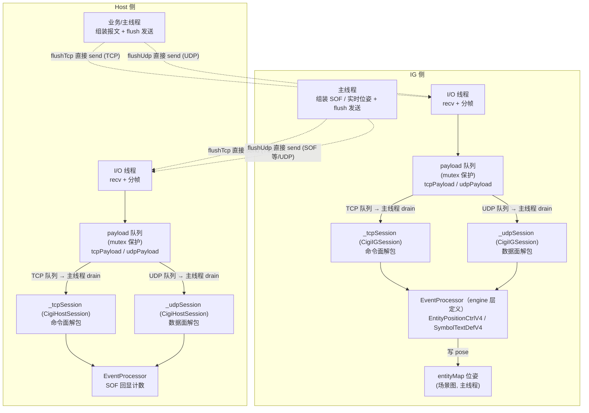

# 状态同步设计·初版（最小可用第一版）

> **本版为「最小可用第一版」**，当前要实现的版本。完整设计（QUERY 悬挂查询、cancelCommand、多 peer 并发等）见 [状态同步设计.md](./状态同步设计.md)（完整版，暂不实现）。

面向本项目 **1 Host + 多 IG** 的同步面设计：Host 通过 **TCP 命令面**一次性精准下发位姿摆放 / 文本指令，通过 **UDP 数据面**持续下发实时位姿；**无业务回执**。

**一句话**：命令/位姿用 CCL 标准报文下发，链路按语义选择（**持续下发走 UDP、一次性精准走 TCP**），**均 fire-and-forget、无业务回执**（TCP 靠传输层可靠、UDP 靠周期覆盖）；业务侧通过暴露的 `CigiOutgoingMsg` 引用批量组装报文后统一 `flush` 发送。

---

## 目录

- [状态同步设计·初版（最小可用第一版）](#状态同步设计初版最小可用第一版)
  - [目录](#目录)
  - [1. 范围与目标](#1-范围与目标)
  - [2. 架构分层图](#2-架构分层图)
  - [3. 时序](#3-时序)
  - [4. 报文与协议](#4-报文与协议)
    - [4.1 命令帧：`CigiEntityPositionCtrlV4` / `CigiSymbolTextDefV4`](#41-命令帧cigientitypositionctrlv4--cigisymboltextdefv4)
    - [4.2 TCP 分帧](#42-tcp-分帧)
  - [5. 传输通道](#5-传输通道)
    - [5.1 I/O 线程 + 主线程解包模型](#51-io-线程--主线程解包模型)
    - [5.2 断线检测](#52-断线检测)
  - [6. 执行模型：I/O 线程收字节 + 主线程解包执行](#6-执行模型io-线程收字节--主线程解包执行)
  - [7. Host 侧设计](#7-host-侧设计)
    - [7.1 API（引用式发送接口）](#71-api引用式发送接口)
    - [7.2 发送流程](#72-发送流程)
  - [8. IG 侧设计](#8-ig-侧设计)
    - [8.1 API](#81-api)
    - [8.2 收包流程](#82-收包流程)
  - [9. 配置与 API](#9-配置与-api)
  - [10. 验收要点](#10-验收要点)
  - [11. 不做与扩展位](#11-不做与扩展位)
  - [12. 与实现关系](#12-与实现关系)

---

## 1. 范围与目标

| 纳入初步 | 暂不纳入 |
|----------|----------|
| 命令帧（`EntityPositionCtrlV4` / `SymbolTextDefV4`）按链路下发 | QUERY / CMD_STATE 悬挂查询 |
| 链路选择：持续 → UDP，一次性 → TCP | cancelCommand / 在途集合 |
| TCP 分帧器（按 `PacketSize` 切流） | 多 peer 并发分发（串行即可） |
| 引用式发送接口（`outMsgWithIgCtrlTcp`/`outMsgWithIgCtrlUdp` + `flush`） | 业务回执（ACK/NACK） |
| 收包入队 + 主线程执行 | 实体预加载（§11） |
| 断线检测 | — |
| **命令读循环线程 + 主线程执行**（见 §6） | — |

**目标**：跑通「Host 下发位姿/指令 → IG 收包执行」的闭环。

**关键认知（写死）：无业务回执。** 命令/位姿下发均 fire-and-forget，不做应用层 ACK/NACK：

- **TCP**：传输层保证字节不丢、保序、到达对端 socket——「精准送达」由 TCP 自身保证，无需应用层回执；
- **UDP**：靠周期覆盖自愈——丢一帧下一帧补上。

**链路选择规则（写死）**：所有 CIGI 报文在 TCP / UDP 两条链路上都支持发送，**具体走哪条链路由业务按语义判断**：

| 语义 | 链路 | 可靠性 |
|------|------|------|
| **持续周期性下发**（实时控制位姿，每帧覆盖） | UDP | 丢包自愈，无需确认 |
| **一次性、需精准送达**（摆放位姿、文本指令） | TCP | TCP 传输层可靠送达 |

**演进说明（写死）**：命令载体为 CCL 标准报文，**不新增自定义报文结构、不手写编解码与字节序**（唯一业务自建的是 §4.2 的 TCP 分帧器）。位姿用 `CigiEntityPositionCtrlV4`，通用文本指令用 `CigiSymbolTextDefV4`（`Text` 每次承载**一个**指令，但指令种类开放——几十种，`std::string` 上限 65528）。原「LOADMODEL/PLACEMODEL/MOVEMODEL + seq + RECEIVED/RESULT 两段回执 + `CigiIGMsgV4` 载荷」方案已否决（模型 IG 侧预加载、MOVE 无 CIGI 对应、业务回执删除）。

---

## 2. 架构分层图



> **双 session（写死，2026-08）**：Host/IG 各持 `_tcpSession` + `_udpSession`（§5.1）——发送隔离（`flushTcp`/`flushUdp` 只打包对应链路 session，空缓冲跳过）+ 收包按链路解包。

> **关键分层（写死）**：
> - I/O 线程只 `recv` 字节入队，**不碰 CCL、不解包、不写场景**；
> - 主线程 `drain` 队列 → `ProcessIncomingMsg` 解包 → processor 写业务状态；
> - CCL（`Cigi*Session`）只在主线程触碰，天然单线程；
> - 发送（`flush`）由业务/主线程直接 `send`，不走 I/O 线程；
> - **processor 由 engine 层定义并注册**（sync 库只透传 `registerEventProcessor`），processor 直接写 `entityMap`。

---

## 3. 时序

```text
Host                                      IG
  │ outMsgWithIgCtrlTcp() << EntityPositionCtrlV4 │
  │ flushTcp()                            │
  │ ───── TCP EntityPositionCtrlV4 ────▶ │  I/O 线程 recv → 入队 tcpPayload
  │  （无回执，TCP 传输层保证送达）        │  主线程 drain → ProcessIncomingMsg → processor 写位姿
  │                                        │
  │ outMsgWithIgCtrlUdp() << EntityPositionCtrlV4 │  （实时控制，每帧）
  │ flushUdp()                            │
  │ ═════ UDP EntityPositionCtrlV4 ═════▶ │  I/O 线程 recv → 入队 udpPayload
  │                                        │  主线程 drain → ProcessIncomingMsg → 实时更新位姿
```

---

## 4. 报文与协议

### 4.1 命令帧：`CigiEntityPositionCtrlV4` / `CigiSymbolTextDefV4`

> **消息结构（写死，CCL 强制，2026-08 实现阶段发现并修正）**：CCL 的 `CigiOutgoingMsg::PackageMsg`/`LockMsg` 要求 **Host 出站消息以 `CigiIGCtrlV4`（PacketID 0x0000）开头**，`CigiIncomingMsg::CheckFirstPacket` 要求 **IG 入站消息首包为 IGCtrl**、**Host 入站消息首包为 SOF（0xffff）**，否则分别抛 `MissingIGControl` / `MissingStartOfFrame`（或返回错误码，取决于 `CIGI_NO_EXCEPT` 宏）。因此命令面消息不能是「纯 `EntityPositionCtrlV4`/`SymbolTextDefV4`」，必须是 **IGCtrl 帧头 + 命令报文**；IG 出站消息同理以 **SOF 帧头** 开头（见 §7 发送对等，IG 侧 `outMsgWithSofTcp()`/`outMsgWithSofUdp()` 自动前置 SOF）。首包约束有负向验收（§10）：**首包非 IGCtrl/SOF 的消息被对端 session 拒绝**。

```text
[IGCtrl(24B)][EntityPositionCtrlV4(48B)]                      // 摆放 / 实时位姿
[IGCtrl(24B)][SymbolTextDefV4(12B+Text)]                      // 文本指令
[IGCtrl(24B)][EntityPositionCtrlV4(48B)][SymbolTextDefV4(...)] // 批量多报文，单次 flush
```

`outMsgWithIgCtrlTcp()`/`outMsgWithIgCtrlUdp()` 自动前置 IGCtrl 帧头（数据面 `TimeStampValid=true`、命令面 `TimeStampValid=false`），业务侧只 `<<` 命令报文。

**`CigiEntityPositionCtrlV4`（位姿）**：

```text
CigiEntityPositionCtrlV4（PacketID 0x01，48B，定长）
  EntityID    : uint16   // 目标实体
  ParentID    : uint16   // 父实体（Attach 时有效）
  AttachState : enum     // Detach=0 / Attach=1
  Yaw/Pitch/Roll : float // 姿态（度）
  Lat / Lon / Alt : double // Detach 时：纬度° / 经度° / 海拔 m
  Xoff / Yoff / Zoff : double // Attach 时：相对父实体 XYZ 偏移 m
```

**`CigiSymbolTextDefV4`（通用文本指令）**：

```text
CigiSymbolTextDefV4（PacketID 0x01d，变长：12B 头 + Text）
  SymbolID   : uint16   // 业务可用作命令编号（可忽略/置 0）
  Alignment / Orientation / FontID / FontSize : 显示字段（命令面不关心，取默认）
  Text       : std::string  // 空格分隔指令文本，UTF-8，每次承载一个指令
```

**指令编码（写死：空格分隔，首 token = 指令名，每次一个指令）**：

```text
Text = "<指令名> <参数1> <参数2> ..."
示例：
  "place 7 121.47 31.23 500"        // 指令名 place，参数：id lon lat alt
  "load teapot"                      // 指令名 load，参数：模型名
  "reset"                            // 指令名 reset，无参数
```

- **指令识别**：IG 侧对 `Text` 按空格切分，首 token 为指令名，据此分发到不同业务逻辑；指令集开放（几十种），由业务层定义，协议层不写死。
- **序列化**：`CigiOutgoingMsg << packet` 由 CCL `Pack` 生成报文，`Text` 由 `SetText` 维护长度与 8 字节对齐，字节序自动处理。
- **约束（写死）**：`Text` 为 UTF-8 文本、NULL 终止、按 8 对齐；**参数分隔不能使用 NUL 字符**（CCL `Unpack` 用 `strnlen` 截取，遇 `\0` 即截断），用空格等可见字符分隔。**第一版参数本身不含空格**（空格分隔下参数含空格会拆散解析），含空格参数（如带空格路径）的引号/转义规则留扩展位。
- **同报文双链路语义（写死）**：`CigiEntityPositionCtrlV4`（`0x01`）在 UDP（实时控制，持续覆盖）与 TCP（一次性摆放，精准送达）上语义不同——**靠收包来源（socket 链路）区分，而非 PacketID**（见 §5.1）。两者均无业务回执，区别仅在频率与可靠性。
- **数据面眼点 vs 命令面位姿的区分（写死，矛盾 A 后演进）**：数据面眼点（ownship `EntityID=0`）与命令面 UDP 位姿（业务 `EntityID≠0`）**共用同一 UDP socket**，且都是 `IGCtrl + EntityPositionCtrlV4` 结构。矛盾 A 后两者统一经 **IG 的 UDP CCL 会话（`_udpSession`）** 解包，区分由 processor 完成：
  - sync 库内部基础设施 `EyeCaptureProc` **只捕获 `EntityID==0`** 的眼点；
  - engine 注册的业务 processor（如 `EntityPlaceProcessor`）**必须按 `EntityID==0` 过滤**（ownship 保留给数据面眼点，命令实体从 `EntityID≠0` 开始）。
  若业务 processor 不过滤，数据面眼点会覆盖命令实体的 `entityId`（E2E 收发一致性断言 `entityId==7` 因眼点覆盖而失败的踩坑驱动此约定，2026-08）。早期实现曾用 IGCtrl `TimeStampValid` 分流（数据面=true / 命令面=false），矛盾 A 后该机制已废弃（现靠**双 session**（§5.1）链路隔离 + processor `EntityID` 过滤区分）。
- **双链路位姿冲突（写死：允许覆盖）**：同一 `EntityID` 可能同时被 TCP（摆放）与 UDP（实时控制）下发，**不区分管控方，谁后到谁生效**——IG 每收到一帧/一条就按最新值更新该实体位姿，TCP 与 UDP 之间无锁定、无优先级、无「接管」语义。业务侧自行保证不产生语义冲突（或接受覆盖）。

### 4.2 TCP 分帧

TCP 是字节流，CCL 的 `CigiIncomingMsg::ProcessIncomingMsg` 假设调用方喂入的是**完整报文**，不做拆包缓存。因此业务层需一个**最小分帧器**，它**只切边界，不编解码、不碰字节序、不定义报文结构**。**分帧器仅在接收端工作**——发送端用 `CigiOutgoingMsg::PackageMsg` 产出带 `PacketSize` 头的完整字节块，直接 `send`，无需分帧。

```text
CIGI V4 报文头（Pack 输出）：
  [PacketSize(2B)][PacketID(2B)][...载荷...]

命令帧（`EntityPositionCtrlV4` 定长 48B / `SymbolTextDefV4` 变长）——都靠头部 `PacketSize` 界定边界，分帧逻辑统一适用。

字节序（写死，CIGI 4 不强制）：CIGI 4（ICD §4.4）不强加字节序，接收方负责 swap。CCL 在 x86 上直接输出**小端**（`PackPointer.s` 直写）；两端同字节序（本项目 Host/IG 均为 x86）则无需转换。分帧器**不假设大端**，按 Packet Size 字段的字节序检测（左首字节为 0 = 大端，右首字节为 0 = 小端）切流。

分帧逻辑（消息级，写死）：
  1. 维护拼帧缓冲
  2. recv → 塞入缓冲
  3. 缓冲 >= 4B？→ 读首包 PacketSize + PacketID（按检测到的字节序）
  4. 首包必须为 IGCtrl（PacketID 0x0000）＝一条消息的开头；向后累积后续非 IGCtrl 包的 PacketSize，直到遇到下一个 IGCtrl 或数据不足
  5. 缓冲 >= 累计消息长度？→ 取完整一条消息 → 交给 CigiIncomingMsg::ProcessIncomingMsg
  6. 剩余继续（粘包/拆包都覆盖）

> 分帧粒度是「**消息**」（IGCtrl + 后续包），不是「单包」——`ProcessIncomingMsg` 的 `CheckFirstPacket` 要求首包为 IGCtrl，若按单包切，第二条起的非 IGCtrl 包会触发 `MissingIGControl`（实现阶段踩坑，2026-08）。
>
> **后续包 body 不完整时等待、不截断（写死，实现阶段修 bug）**：分帧器读到「后续包的头完整、但 body 未到齐」时，必须**等更多数据**（`messageLength` 返回 `nullopt`），不得把「首包 + 已到的部分」误切成一条完整消息——否则一条多包消息被 TCP 拆在包 body 中间时会截断丢包（`CigiFrameAssembler buffers a split message across feeds` 单测覆盖，2026-08）。「读不到下一个包头」时则乐观认为消息结束（命令面一条 flush 即一条消息，消息小、本地回环下极少恰好拆在包边界）。
```

> `ProcessIncomingMsg` 内部会按 `PacketID` 查表分发到对应 `EventProcessor`，无需业务逐包 switch。

---

## 5. 传输通道

### 5.1 I/O 线程 + 主线程解包模型

| 现状 | 缺口 |
|------|------|
| TCP 握手已通（HELLO/HELLO_ACK），连接保留在 peer 表 / `_tcp` | **已实现（命令面 + 数据面）**：命令帧改 CCL 标准报文 + 消息级分帧器（§4.2）；数据面（矛盾 A）已并入 CCL——Host 业务侧组装、IG 统一会话解包；**2026-08 双 session 化**（§5.1）：Host/IG 各持 `_tcpSession` + `_udpSession`，发送隔离（flush 只发对应链路）、收包按链路解包 |

> **实现进度（2026-08，矛盾 A + IG 数据面 I/O 线程化完成；2026-08-25 IGCtrl 自动填充）**：
> - **Host 侧**：`HostSync::update` 已删除。**`outMsgWithIgCtrlUdp()`/`outMsgWithIgCtrlTcp()` 自动前置 IGCtrl**（CCL 硬约束，§4.1）：`outMsgWithIgCtrlUdp()` 填数据面帧号 + 自计时 `TimeStamp`（`TimeStampValid=true`）、`outMsgWithIgCtrlTcp()` 填命令面帧号（`TimeStampValid=false`）。业务侧（viewhost `HostDriver`；engine 已不承担 Host，原 `HostPosePublisher` 删除）每帧 `outMsgWithIgCtrlUdp() << 眼点`（经 `cigi_wire::appendEye` 组装）→ `flushUdp()`；一次性命令 = `outMsgWithIgCtrlTcp() << 报文` → `flushTcp()`。原 `appendHostFrame`（IGCtrl+眼点整体组装）已删除，IGCtrl 归属 sync。
> - **IG 侧**：数据面 + 命令面**按链路分会话**解包（2026-08 双 session）——UDP 队列喂 `_udpSession`（数据面 IGCtrl/眼点 + 命令面 UDP 报文）、TCP 队列喂 `_tcpSession`（命令面 TCP 报文）。**UDP 收包已拆到独立 I/O 线程**（`udpLoop`：非阻塞 `recv` → 过滤握手面 → 入队 `_udpPayloadQueue`，并在 recv 时刻记录 `receivedAtUs`）；主线程收包入口收敛为 **`IgSync::drainIncoming()`**（统一 drain TCP+UDP → 按链路喂各 session 解包，见 §8.1 收包入口对等化；空队列按 1ms 步进等待最多 5ms 后再试，保证刚发到的数据报当帧可见），`IgSync::update()` 只做帧级维护（冻结 + 状态）。sync 库内部注册基础设施 processor（`IgCtrlCaptureProc` 捕获帧号/时间戳、`EyeCaptureProc` 只捕获 ownship `EntityID==0` 眼点并翻译为 `HostEyePose` 订阅投递、`SofCaptureProc` 计数，见 §8.1 通用模式）；业务 processor 经 `registerEventProcessor` 注册。旧的 `TimeStampValid` 分流与 `dispatchCommandPlaneFrame` 已删除。
> - 遗留：Host 侧仍为「accept 线程 + udpLoop 线程」、IG 侧为「commandLoop（TCP）+ udpLoop（UDP）」两个 I/O 线程，尚未收敛到「单一 I/O 线程 select 多路复用」的最终形态（见下文目标模型）；`packHostFrame`/`unpackHostFrame` 保留为线格式测试锚定 helper，运行时不再使用。

**收发线程模型（写死）**：每端 **一个 I/O 线程**包办 TCP + UDP 两条链路的所有**接收**，**recv 字节 → 分帧 → 入队完整报文**（分帧器挂 I/O 线程，见 §4.2，只切边界、不碰 CCL、不解包）；解包统一在主线程。

```text
Host 侧：
  I/O 线程（一条，select 多路复用 TCP 各 peer + UDP + listen）：
    recv 字节 → 分帧 → 入队完整报文（tcpPayload / udpPayload 两队列）→ 不解包
  accept 线程：仅 accept 新连接，挂入 I/O 线程的 select 集合
  主线程：drain 完整报文 → CCL 解包（SOF 回显计数等）

IG 侧：
  I/O 线程（一条，select TCP + UDP）：
    recv 字节 → 分帧 → 入队完整报文（tcpPayload / udpPayload 两队列）→ 不解包
  主线程（帧循环）：drain 完整报文 → CigiIncomingMsg::ProcessIncomingMsg 解包 → 触发 processor → 执行
```

> **发送不走 I/O 线程（写死）**：`flushTcp()/flushUdp()` 由调用方（主线程/业务线程）直接 `PackageMsg` + `send`，I/O 线程只负责**收**。发送是主动、非阻塞、低频（命令面）或每帧（数据面，主线程本身驱动），无需发送队列。
>
> **分帧器归属（写死）**：TCP 分帧器（§4.2）挂 **I/O 线程**（持有 socket、天然维护拼帧缓冲），产出的是**完整报文**；主线程 drain 出的就是完整报文，直接喂 `ProcessIncomingMsg`。分帧器只切边界、不碰 CCL，与「I/O 线程不解包」不冲突。
>
> **CCL 单线程化 + 每链路独立会话（写死，2026-08 双 session）**：解包（`CigiIncomingMsg::ProcessIncomingMsg`）**只在主线程调用**，CCL 非线程安全问题从根上消除。CCL 会话**按链路持有**：Host / IG 各持 **`_tcpSession` + `_udpSession`**（同角色、同类型 `Cigi*Session`），而不是此前「各角色一套」。原因不是线程安全，而是**发送隔离**——`CigiOutgoingMsg` 状态（buffer 位置、IGCtrl/SOF 前置标记）挂在会话上：`outMsgWithIgCtrlTcp()/flushTcp()` 与 `outMsgWithIgCtrlUdp()/flushUdp()` 若共用同一会话，`outMsgWithIgCtrlTcp()<<…→flushUdp()` 会把命令面报文经 UDP 发走（实现阶段发现的错发漏洞，2026-08）。拆双 session 后 flush 只打包**对应链路** session 的 OutgoingMsgMgr，另一链路无待发内容时 `PackageMsg` 失败（空缓冲），**不发送任何字节**。
>
> **收发均按链路走各自会话（写死）**：`outMsgWithIgCtrlTcp()` 绑定 `_tcpSession`、`outMsgWithIgCtrlUdp()` 绑定 `_udpSession`；收包同样按链路解包——UDP 收包队列喂 `_udpSession`、TCP 收包队列喂 `_tcpSession`。IG 侧命令面 IGCtrl（TCP）与数据面 IGCtrl（UDP）因此**解包分离**：命令面 IGCtrl 不会进入数据面的帧号/时间戳/回 SOF 路径，杜绝「命令面 IGCtrl 被当数据面帧、`_frameCounter`/时钟被污染」。
>
> **CCL 会话创建策略（写死，性能决策）**：`CigiSession` 构造/析构曾因 `CigiIncomingMsg` 内含 `EventList[0x10000]` + `CallBackList[0x10000]`（131072 个 `std::list`）在 MSVC Debug 下约 80ms/op；已将这两个数组惰性化为 `std::map`（仅实际注册/解包的 PacketID 分配 entry），构造/析构降到微秒级。会话因此**无需再为性能刻意推迟**，且按链路懒创建：`_tcpSession` 在首次 `outMsgWithIgCtrlTcp()/flushTcp()` 或 TCP 收包解包时创建，`_udpSession` 在首次 `outMsgWithIgCtrlUdp()/flushUdp()` 或 UDP 收包解包时创建（各链路 `ensureTcpSession`/`ensureUdpSession` 时注册该链路的基础设施 processor，见 §8.1）。
>
> **I/O 多路复用（写死）**：一个 I/O 线程同时管 TCP（多 peer）+ UDP，需 `select`/`poll`/`WSAEventSelect`（Windows 用 `select` 或 `WSAEventSelect`）。Host 侧 peer 表增减时动态更新 select 集合。

### 5.2 断线检测

- I/O 线程是唯一 `recv` 者：读到 EOF（`recv` 返回 0）即判定断线，联动 `markDisconnected()`、摘除 peer、移出 select 集合；
- 物理断网（无 FIN/RST）时 `recv` 卡住，需 `recv` 超时或心跳兜底（[socket总结.md](../notes/socket总结.md) §5.1）；I/O 线程的 `SO_RCVTIMEO` 超时唤醒可作弱心跳，但静默断网仍依赖外部心跳（扩展位）。
- **第一版实现（写死）**：第一版即实现 `SO_RCVTIMEO` 超时唤醒（现有 `TcpSocket::setRecvTimeout` 已具备），超时视为「无数据」，循环继续；真正断网仍依赖外部心跳（扩展位）。

---

## 6. 执行模型：I/O 线程收字节 + 主线程解包执行

**第一版采用「I/O 线程只收字节入队 + 主线程解包 + processor 执行」**：

```text
IG I/O 线程（connect 成功后启动，独立线程，select TCP+UDP）：
  recv 字节 → 分帧 → 入队完整报文（tcpPayload/udpPayload）→ 不解包 → 处理下一段

IG 主线程（帧循环，SynchronSystem::preFrame）：
  IgSync::drainIncoming() 统一 drain tcpPayload/udpPayload → CigiIncomingMsg::ProcessIncomingMsg 解包
    → 触发对应 EventProcessor.OnPacketReceived
    → processor 写 entityMap pose（场景图，主线程安全）
  IgSync::update() 帧级维护（冻结 / RUNNING），随后取眼点决策
```

> **解包归主线程（写死）**：`ProcessIncomingMsg` + `EventProcessor` 全部在主线程调用。理由：processor 要写场景图（`transform->matrix`），场景图与 GPU 对象只允许渲染线程侧修改——独立执行线程改场景会与渲染遍历并发，实测崩溃（§6 实机崩溃驱动）。解包归主线程后，processor 天然可写场景，无需锁。
>
> **SOF 回显（写死）**：主线程 `drain` 后解包**每条 IGCtrl 即回一条 SOF**（帧号一一对应）。SOF 携带 `FrameCntr` 是**帧号回显**（丢帧检测用），不是低延迟心跳；主线程 60fps、Host 180fps 时一次 drain 可能回 3 条 SOF（帧号 N、N+1、N+2），**帧号不丢、计数正确**，仅到达 Host 时刻批量化——对帧号回显无害。Host 健康/断线判断靠 **TCP 断线检测（§5.2）+ UDP SOF 计数**，不依赖 SOF 到达频率。
>
> **读循环线程职责收敛（写死）**：I/O 线程只 `recv` 字节 + 分帧 + 入队完整报文，**不碰 CCL、不解包、不写场景**。断线检测并入 I/O 线程（§5.2）。
>
> **processor 分层（写死）**：每个 CIGI 报文一个 `CigiBaseEventProcessor`，processor 只做「捕获字段 + 写业务状态」（如 `EntityPositionCtrlV4` 的 processor 直接查 entityMap 写位姿）。与数据面 `Capture*Proc`（捕获字段）一致，业务逻辑收敛在 processor 内。

- 命令低频事件驱动，主线程每帧 drain 队列处理；
- 命令执行耗时取决于指令类型（place 微秒级、load 可能百 ms），执行归主线程、无回执，故不阻塞 Host 侧；
- 多 peer：Host 侧单 I/O 线程 select 管理所有 peer（替代「每 peer 一条读循环线程」）。

---

## 7. Host 侧设计

### 7.1 API（引用式发送接口）

业务侧**组装好 CCL 报文对象**，通过暴露的 `CigiOutgoingMsg` 引用批量写入，最后统一 `flush` 发送。**不再为每种报文提供专用发送方法**（避免每加一个报文就加一个接口）。

> **HostSync 无 `update` 方法（写死，已实现 2026-08）**：系统帧节拍（IGCtrl / 眼点）与实时控制位姿**均由业务侧（viewhost `HostDriver`；engine 已不承担 Host）组装**进 `CigiOutgoingMsg`，`flush` 是唯一发送入口。业务侧每帧发送 = `outMsgWithIgCtrlUdp() << 眼点 << 实时位姿` → `flushUdp()`；一次性命令 = `outMsgWithIgCtrlTcp() << 报文` → `flushTcp()`。**IGCtrl 帧头由 `outMsgWithIgCtrlTcp()`/`outMsgWithIgCtrlUdp()` 自动前置（CCL 硬约束：Host 报文首包必须 IGCtrl，§4.1），业务侧只 `<<` 业务报文**。`HostSync::update` 已删除。
>
> **数据面 IGCtrl 自动填充（写死，2026-08-25）**：`outMsgWithIgCtrlUdp()` 自动前置 `CigiIGCtrlV4` 并填充——
> - `FrameCntr` = 数据面帧号（`outMsgWithIgCtrlUdp()` 内部数据面计数器自动分配，与命令面解耦）；
> - `TimeStamp` = **HostSync 自计时的模拟时间**（`initialize()` 时记录 `_startTime = steady_clock::now()`，每次 `outMsgWithIgCtrlUdp()` 计算 `simTimeMs = (now - _startTime)`，`TimeStamp = simTimeMs×100`，10µs 步进，见 `simTimeMsToTimeStamp`）；
> - `TimeStampValid = true`（数据面时间戳有效）。
>
> **数据面时间基准前提（写死）**：`simTimeMs` = steady_clock 从 HostSync 启动起的流逝（等价于现状 Engine `_simStartMs(=0) + elapsedMs`，时钟同步方案.md §4.0/§5）。**若未来需要非零起始模拟时间（从配置加载 `_simStartMs`），须恢复业务侧注入 `simTimeMs`**——本设计假设模拟时间从 Host 启动 0 起、实时推进。
>
> **命令面 IGCtrl 自动填充（写死，2026-08-25）**：`outMsgWithIgCtrlTcp()` 自动前置 `CigiIGCtrlV4` 并填充——`FrameCntr` = **命令面帧号**（独立计数器，与数据面解耦）、`TimeStampValid = false`（命令面不携带有效时间戳）。因此 Host 出站两类报文首包均为 IGCtrl：UDP 数据面时间戳有效、TCP 命令面时间戳无效（§10 验收）。
>
> **帧头去重（写死，2026-08-25）**：`outMsgWithIgCtrlTcp()`/`outMsgWithIgCtrlUdp()`（及 IG 侧 `outMsgWithSofTcp()`/`outMsgWithSofUdp()`）**单次 flush 周期内多次调用只填一次帧头**——内部状态跟踪当前消息已填帧头则跳过，`flushTcp`/`flushUdp` 打包后重置。这使「多次 `<<` 报文再统一 flush」成为安全用法，且帧号只递增一次（接收端恰好收到一个 IGCtrl/SOF，§10 验收）。
>
> **眼点组装（写死）**：`outMsgWithIgCtrlUdp()` 自动前置 IGCtrl 后，眼点 `EntityPositionCtrlV4` 由业务侧经 **`cigi_wire::appendEye(CigiOutgoingMsg&, const EyePose*)`** 追加（LLA 归一化/越界丢弃、Attach/Detach、ParentID=0/1 语义保留，lla位姿传输设计.md §5）。`appendHostFrame`（原 IGCtrl+眼点整体组装）已删除——IGCtrl 归属 sync，眼点归属 cigi_wire 辅助。

```text
// 命令面（TCP）：批量组装后统一发送（fire-and-forget，靠 TCP 可靠送达）
CigiOutgoingMsg& outMsgWithIgCtrlTcp();   // 绑定 _tcpSession，开消息 + 自动前置 IGCtrl（帧号=命令面，TimeStampValid=false；同轮多次调用去重）
void flushTcp();                      // 打包 _tcpSession 的 omsg → 发送到所有 ready peer + FreeMsg

// 数据面（UDP）：批量组装后统一发送
CigiOutgoingMsg& outMsgWithIgCtrlUdp(); // 绑定 _udpSession，开消息 + 自动前置 IGCtrl（帧号=数据面，TimeStamp=自计时，TimeStampValid=true；同轮多次调用去重）
void flushUdp();                       // 打包 _udpSession 的 omsg → 发送到所有 ready peer + FreeMsg
```

业务侧示例：

```cpp
// 命令面：beginWithIgCtrl() 已自动前置 IGCtrl（帧号=命令面、TimeStampValid=false）
auto& tcp = host.outMsgWithIgCtrlTcp();
CigiEntityPositionCtrlV4 place;
place.SetEntityID(7);
place.SetLat(31.23); place.SetLon(121.47); place.SetAlt(500.0);
tcp << place;                       // 可再 << 其他报文（批量）
host.flushTcp();                    // 统一 package + send

// 数据面：beginWithIgCtrlUdp() 已自动前置 IGCtrl（帧号=数据面、TimeStamp=自计时、TimeStampValid=true）
auto& udp = host.outMsgWithIgCtrlUdp();
cigi_wire::EyePose eye{...};
cigi_wire::appendEye(udp, &eye);    // 可选：追加眼点 EntityPositionCtrlV4
host.flushUdp();                    // 统一 package + send
```

> **双 session 隔离（写死，2026-08）**：`outMsgWithIgCtrlTcp()/flushTcp()` 只操作 `_tcpSession`，`outMsgWithIgCtrlUdp()/flushUdp()` 只操作 `_udpSession`——**命令面报文不会被 `flushUdp()` 发出，数据面报文不会被 `flushTcp()` 发出**。误用（`outMsgWithIgCtrlTcp()<<…→flushUdp()`）时，flush 打包的是**另一链路**（UDP）session——该链路无待发内容，`PackageMsg` 空缓冲失败 → **不发送任何字节**（§7.2）。帧号解耦：命令面 IGCtrl 帧号与数据面帧号各用独立计数器（数据面由 `outMsgWithIgCtrlUdp()` 内部自动递增），互不消耗（§5.1）。
>
> **线程安全（写死）**：CCL `CigiOutgoingMsg` 非线程安全，`outMsgWithIgCtrlTcp()/outMsgWithIgCtrlUdp()` 返回的引用**同一时刻只能被一个线程操作**；`flush` 完成一轮（`PackageMsg` + send + `FreeMsg`）后引用方可复用。双 session 后 TCP/UDP 两链路各自独立，但同链路内部仍遵守此约束。
>
> **已知隐患 / 未来优化项（第一版不上锁）**：当前**未做并发保护**——仅靠「业务侧单线程发送」这一约定维持正确性（现状业务命令均由单一 UI/命令触发线程发出，无并发写）。若未来出现多线程并发发命令，`CigiOutgoingMsg` 内部状态（buffer 位置）与 socket 写会互相踩踏，需择一上锁（三方案见 §11）。

### 7.2 发送流程

```text
flushTcp() → void（打包 _tcpSession 的 omsg）：
  1. PackageMsg 当前 outMsgWithIgCtrlTcp 缓冲 → 字节；空缓冲（该链路从未 BeginMsg）→ 直接跳过，不发送
  2. 快照当前 ready IG 列表
  3. 对每个 ready peer：TCP 写字节（sendAll）
  4. FreeMsg 释放缓冲；重置帧头去重标志（下一轮 outMsgWithIgCtrlTcp 重新填 IGCtrl）

flushUdp() → void（打包 _udpSession 的 omsg）：
  1. PackageMsg 当前 outMsgWithIgCtrlUdp 缓冲 → 字节；空缓冲（该链路从未 BeginMsg）→ 直接跳过，不发送
  2. 快照当前 ready IG 列表
  3. 对每个 ready peer：UDP sendTo 字节
  4. FreeMsg 释放缓冲；重置帧头去重标志（下一轮 outMsgWithIgCtrlUdp 重新填 IGCtrl）
```

> **空缓冲跳过（写死，双 session 隔离的物理保障）**：flush 只打包**对应链路** session 的 omsg。若该链路从未调用 `outMsgWithIgCtrlTcp()/outMsgWithIgCtrlUdp()`（无待发内容），`PackageMsg` 抛 `CigiCalledOutOfSequenceException` 或返回错误码（取决于 `CIGI_NO_EXCEPT`）——flush 捕获后**不发送任何字节**。这保证 `outMsgWithIgCtrlTcp()<<…→flushUdp()` 这类误用不会产生网络流量，对端收不到任何报文。
>
> **返回值语义（写死）**：`flush` 为 fire-and-forget，**不返回送达结果**。TCP 由传输层保证字节送达（`sendAll` 失败即底层断连，走 §5.2 断线检测）；UDP 尽力而为，丢包由周期覆盖自愈。**部分 peer 发送失败不影响其他 peer**（逐个 `sendAll`/`sendTo`，某 peer 失败继续发下一个，不中断本轮）。

---

## 8. IG 侧设计

### 8.1 API

```text
// 注册某个 CIGI 报文的业务 EventProcessor（透传到 CCL session 的 RegisterEventProcessor）
void registerEventProcessor(int packetId, CigiBaseEventProcessor* processor);

// 发送（对等 Host §7）：IG 出站消息自动前置 SOF 帧头（CCL 要求 IG 消息以 SOF 开头）
CigiOutgoingMsg& outMsgWithSofTcp();   // 绑定 _tcpSession；业务侧 << 报文后调 flushTcp 发送（IG→Host TCP 上报/回传）
void flushTcp();                   // 打包 _tcpSession 的 omsg → sendAll 到 Host（TCP）；空缓冲跳过；重置帧头去重
CigiOutgoingMsg& outMsgWithSofUdp(); // 绑定 _udpSession；业务侧 << 报文后调 flushUdp 发送（IG→Host UDP 上报/回传）
void flushUdp();                   // 打包 _udpSession 的 omsg → sendTo Host targetUdpPortRecv（UDP）；空缓冲跳过；重置帧头去重
```

> **Host 对等收包（写死，2026-08 双向命令面）**：`HostSync` 同样提供 `registerEventProcessor` 处理 **所有 IG→Host 方向报文**（不限于某一种）——业务 processor 注册后，IG 经 `IgSync::outMsgWithSofTcp()/outMsgWithSofUdp() << <IG→Host 报文> → flushTcp()/flushUdp()` 发来的报文由 Host 主线程 `drainIncoming()` 解包分发（**TCP/UDP 链路均支持**）。Host 收包为 **push 模式**（无独立帧循环）：UDP/TCP I/O 线程只 recv 入队，业务/测试显式调 `drainIncoming()` 触发解包；`sofReceivedCount()` 内部亦会 drain（SOF 计数改由基础设施 `SofCaptureProc` 经 CCL 解包捕获，替代手写 `unpackSof`）。
>
> **双 session 隔离（写死，2026-08，对等 Host §7）**：`IgSync::outMsgWithSofTcp()/flushTcp()` 只操作 `_tcpSession`，`outMsgWithSofUdp()/flushUdp()` 只操作 `_udpSession`——**命令面报文不会被 `flushUdp()` 发出，UDP 上报不会被 `flushTcp()` 发出**。误用（`outMsgWithSofTcp()<<…→flushUdp()`）时 flush 打包的是另一链路（UDP）session，无待发内容 → `PackageMsg` 空缓冲失败 → **不发送任何字节**。收包同样按链路解包：UDP 队列喂 `_udpSession`、TCP 队列喂 `_tcpSession`，IG 侧命令面 IGCtrl（TCP）与数据面 IGCtrl（UDP）解包分离，命令面 IGCtrl 不进入数据面帧号/时间戳路径（§5.1）。
>
> **IG 侧 UDP 发送目标（写死）**：`IgSync::flushUdp()` 发送到 Host 的 `targetUdpPortRecv`（同 `sendSofPacket`）；与 Host 侧 `outMsgWithIgCtrlUdp()`（Host→IG 数据面）对称，实现「双方 TCP/UDP 收发对等」。
>
> **IG→Host 报文载体（写死，2026-08）**：IG→Host 方向支持**该方向的所有 CIGI 报文**（CCL 原生，无需扩展）——只要报文属于 IG 出站表（`SetOutgoingIGV4Tbls`）与 Host 入站表（`SetIncomingHostV4Tbls`）内置集合即可，例如：
> - **`CigiIGMsgV4`**（`0x0ff0`）：通用文本消息，`Msg` 为 8 字节对齐（含 NUL 填充），业务侧按 C 字符串（`strnlen`）取文本；
> - **`CigiCollDetSegRespV4`**（`0x0ff4`）：碰撞检测段响应（IG 应答 Host 的 `CollDetSegDefV4`）；
> - **`CigiCollDetVolRespV4`**（`0x0ff3`）：碰撞检测体积响应（IG 应答 Host 的 `CollDetVolDefV4`）。
>
> `SymbolTextDefV4` 保持 CIGI 标准语义（仅 Host→IG），**不**扩展为双向；CCL 的 `SetIncomingHostV4Tbls`/`SetOutgoingIGV4Tbls` 不做任何改动（上述报文均属内置集合）。

> **两类 processor（写死）**：
>
> | 类 | 定义方 | 例子 | 依赖 | 注册方式 |
> |---|---|---|---|---|
> | **基础设施 processor** | sync 库**内部**（不暴露给 engine），统一定义于 `EventProcess.h/.cpp` | SOF 回显计数、IGCtrl 帧号/时间戳捕获、眼点捕获（`IgCtrlCaptureProc`/`EyeCaptureProc`/`SofCaptureProc`）、**通用捕获模板 `PacketCaptureProc<PacketT>`**（全 9 类报文，含 `CigiCollDetVolDefV4`/`CigiCollDetVolRespV4`——原 `CollDetVolDefProc`/`CollDetVolRespProc` 已由模板替代，见 [cigi梳理.md](../notes/cigi梳理.md) 实现状态） | 只依赖 sync 库自身状态（`_sofReceivedCount`、`_lastFrameCntr`） | sync 库自行注册 |
> | **业务 processor** | engine 层定义，经 `registerEventProcessor` 注册 | `EntityPlaceProcessor`（写 entityMap 位姿）、文本指令分发 | 依赖 engine 场景状态（entityMap） | engine 注册 |
>
> 后果（写死）：engine **只注册业务 processor**，不必为 SOF/IGCtrl/眼点等基础设施报文各写一个 processor；`registerEventProcessor` 是**业务 processor 专用入口**，基础设施 processor 由 sync 库内部自行注册，不经过此接口。
>
> **双 session 下 processor 按链路注册（写死，2026-08）**：每链路 session 只注册「该链路可能到达的报文」的 processor——
> - **Host**：`SofCaptureProc`（SOF 回显）**两个 session 都注册**（数据面 SOF 走 UDP，IG TCP 上报的消息头也是 SOF）；碰撞检测响应 `PacketCaptureProc<CigiCollDetVolRespV4>` 注册 `_tcpSession`（响应走 TCP）；业务 processor（IG→Host 上报，如 `CigiIGMsgV4`）**两个 session 都注册**（IG 可能经 TCP 或 UDP 发来）。
> - **IG**：数据面 `IgCtrlCaptureProc`/`EyeCaptureProc` 注册 `_udpSession`（数据面 IGCtrl/眼点只经 UDP 到达）；碰撞检测定义 `PacketCaptureProc<CigiCollDetVolDefV4>` 注册 `_tcpSession`（定义走 TCP）；业务 processor（Host→IG 命令，如 `EntityPositionCtrlV4`/`SymbolTextDefV4`）**两个 session 都注册**（命令可能经 TCP 一次性下发或 UDP 实时下发）。
> `registerEventProcessor` 内部将业务 processor 同时注册到 `_tcpSession` + `_udpSession`，业务侧无感知；基础设施 processor 由 sync 库按上表注册到对应 session。
>
> **报文 → 链路 / 频率注册总纲（写死，2026-08）**：每个 CIGI 报文的「链路」与「频率」由 CIGI 官方语义 + §1 链路选择规则（**持续 / 每帧走 UDP，一次性 / 配置 / 请求走 TCP**）确定，完整矩阵见 [cigi梳理.md](../notes/cigi梳理.md)（9 类表各含「链路」「频率」两列）。总纲：
> - **方向** 决定注册端点：Host→IG 报文在 `IgSync` 注册收包 processor，IG→Host 报文在 `HostSync` 注册。
> - **频率** 决定注册 session：**持续 / 每帧**（IGCtrl、SOF、ViewCtrl、实时位姿、速度/加速度、钳制实体等）→ **UDP**；**一次性 / 配置 / 请求 / 响应**（Def、状态类 Ctrl、Req/Resp、事件通知、文本命令、符号定义等）→ **TCP**。
> - 基础设施 processor 按上述规则注册到对应 session（见上「双 session 按链路注册」）；业务 processor 的 `registerEventProcessor` 保持**双 session 注册**（收包端两链路都解包——命令可能经 TCP 一次性下发或 UDP 实时下发）。
>
> **processor 归属（写死，2026-08 确立）**：**所有** CIGI 报文的 processor（基础设施与业务）统一定义在 **`EventProcess.h` / `EventProcess.cpp`**——`EventProcess` 是 sync 库的「CIGI 报文处理单元集合」文件，新增报文处理一律在此新增类，不散落在 `IgSync`/`HostSync`/业务代码中。基础设施 processor 由 sync 库持有并注册，业务 processor 由 engine 定义在 `EventProcess.h` 之外（engine 侧）但同样遵循「一个报文一个 processor」。
>
> **基础设施 processor 通用模式（写死，2026-08 确立）**：对**所有** CIGI 报文的获取/处理，基础设施 processor 遵循统一形态——**捕获 → 在 processor 内完成全部字段提取与转换（算到最终需要的数据形态）→ 缓存到 processor 自身 → IgSync 开放 getter 供外部拉取**：
>
> ```text
> 基础设施 processor（注册于 IgSync CCL session）
>   OnPacketReceived: 提取报文字段 → 转换/缓存自身成员（或翻译后经 sink 订阅投递）
> IgSync 公开接口
>   subscribe<PacketT>() / subscribeEyePose() —— 捕获时同步投递；lastIgCtrlFrameCntr() / igCtrlReceivedCount() 等直接返回 processor 缓存
> ```
>
> - **processor 是单一数据源**：不再有「processor 捕获 → 中转缓存 → 拉取」的多层拷贝（`EyeCaptureProc` 已收敛；`IgCtrlCaptureProc` 的帧号/时间戳同理）；如需「取走即清」语义，由 getter 判断 processor 的捕获标志（如 `got`）并在下一帧 reset 时自然清空。
> - **缓存数据结构：CCL 报文值拷贝（写死，2026-08）**：CCL `IncomingHandlerTbl` 是**复用单例**，报文对象每次解包被覆盖，不能直接缓存**指针**——processor 必须**值拷贝**（如 `EyeCaptureProc` 捕获 `CigiEntityPositionCtrlV4` 后立即翻译为 `HostEyePose` 投递）。眼点映射逻辑（CCL AttachState → `HostEyePose.frame`）**已收敛回 `EyeCaptureProc`**（2026-08，捕获时翻译并经订阅投递，见 §12 眼点链路收敛行）；其余报文以 CCL 原生类型经订阅投递，后续按需翻译为自建结构。
> - **通用捕获模板（写死，2026-08，纯订阅）**：为覆盖全 9 类报文收包，`EventProcess.h` 提供 `PacketCaptureProc<PacketT>`（继承 `CigiBaseEventProcessor` + `Sinkable<PacketT>`）：`OnPacketReceived` 里 `dynamic_cast` + 经 sink **同步投递**（变长字段为 `std::string`/`vector`，深拷贝安全）。`IgSync`/`HostSync` 各持一组按链路注册的模板实例。**数据交付为纯订阅模式（2026-08 收敛）**：
> > - `subscribe<PacketT>(callback)` 注入业务回调，报文捕获时同步投递（`setSink`）；回调在主线程解包时调用，**只做轻量翻译/入队/置标志**（§8.1 重量约束），重量业务留帧循环消费队列；生命周期同业务 processor（宿主保证覆盖会话）。订阅调用时会确保会话已创建。
> > - 原「拉模式」（`takeReceived<PacketT>()`/`CaptureProcBase`/缓存 has/take/captured）**已删除**（2026-08，无业务消费者）。
> > **sink 能力抽象（2026-08）**：`setSink`/`_sink` 抽到 `Sinkable<PacketT>` mixin（类型化投递回调，**不继承** `CigiBaseEventProcessor`——后者由 `PacketCaptureProc` 自己继承）；`PacketCaptureProc` 继承之。
> > **定制扩展（2026-08）**：`OnPacketReceived` 为虚函数，默认实现 = dynamic_cast + sink 投递。需业务翻译/过滤的报文可**派生模板并 override**（投递非原始报文类型时改用 `Sinkable<语义类型>` 混入；范例 `EyeCaptureProc` 直接继承 `CigiBaseEventProcessor` + `Sinkable<HostEyePose>`，捕获 ownship 眼点后翻译投递）。未定制报文直接用模板实例化，零样板。
> > 业务侧选型：**事件/响应类报文**（Los/Position/Sensor/EventNotification 等一次性）用订阅免轮询；**决策类**（眼点/IGCtrl/时钟）维持既有数据流（`preFrame → update → takePendingCameraPose`）。
> 全 9 类报文注册矩阵见 [cigi梳理.md](../notes/cigi梳理.md)「实现状态」。
> - 已实例：`EyeCaptureProc`（定制 processor：ownship CCL → 翻译 `HostEyePose` 订阅投递）、`IgCtrlCaptureProc`（缓存 `CigiIGCtrlV4` 值，帧号/时间戳由 `processIncomingUdp` 消费）、`SofCaptureProc`（SOF 计数）、`PacketCaptureProc<...>`（其余全部可达报文，含 `CigiCollDetVolDefV4`/`CigiCollDetVolRespV4`——原 `CollDetVolDefProc`/`CollDetVolRespProc` 已收敛入模板，2026-08）。
>
> **碰撞检测收发（写死，2026-08 规划）**：Host 经 **TCP 命令面**下发 `CollDetSegDefV4`/`CollDetVolDefV4` → IG 收到后回 `CollDetSegRespV4`/`CollDetVolRespV4`（成对）。processor 定义于 `EventProcess`；首版报文数据内容填充默认值，后续按业务字段落地。方向与 Seg/Vol 对称：Def = Host→IG（请求），Resp = IG→Host（应答）。
>
> **processor 生命周期（写死）**：engine 注册的业务 processor 对象，其**生命周期必须覆盖 sync 会话**（engine 保证 processor 在 `IgSync::shutdown` 之后才析构，与旧 `VsgEllipsoidTransform` 适配器的「宿主保证生命周期」约定同类，后者已随 `setEllipsoidMode(bool)` 移除）；否则 CCL session 持有悬空指针。
>
> **不再提供 `setPlaceHandler`/`setCommandHandler`（写死）**：业务逻辑收敛在 processor 的 `OnPacketReceived` 里（如 `EntityPlaceProcessor` 直接写 `entityMap` 位姿），无需再包一层 handler 间接。
>
> **processor 内职责边界：轻量逻辑 vs 重量业务转交（写死，2026-08）**：`OnPacketReceived` 由 `ProcessIncomingMsg` **同步**调用（解包调用栈内），其内做什么就阻塞解包多久；且报文对象是 CCL 复用的临时单例（§8.2「立即消费」）。故业务 processor 的 `OnPacketReceived` **只允许轻量、同步、立即消费**的逻辑：
>
> | 类别 | 是否允许 | 例子 |
> |---|---|---|
> | **轻量**（解析字段 → 写内存/场景状态/分发指令） | ✅ 收敛在 processor 内 | `EntityPositionCtrlV4` 写 entityMap 位姿、`SymbolTextDefV4` 按首 token 分发 |
> | **重量**（模型加载、资源 IO、异步编排、外部系统调用，百 ms 级） | ❌ 不得整体塞进回调 | `load` 模型加载等重量指令 |
>
> 重量业务的正确形态：processor 内**捕获字段 → 入队/置标志**即返回（不阻塞解包与主线程帧循环），由业务层下一步（主线程同帧或后续帧）消费执行；业务层持 `entityMap` 等状态，processor 只负责「报文 → 业务事件」的翻译。该约束不改变 §6「执行归主线程」——转交的消费仍在主线程，只是不在 `ProcessIncomingMsg` 调用栈内完成重量工作。


### 8.2 收包流程

```text
I/O 线程（select TCP+UDP，recv + 分帧）:
  1. recv 字节 → 分帧 → 入队完整报文（tcpPayload/udpPayload）→ 不解包

主线程（帧循环，SynchronSystem::preFrame）:
  2. `IgSync::drainIncoming(true)` 统一 drain tcpPayload+udpPayload
  3. 按链路喂对应 session 解包：UDP 队列 → `_udpSession`（数据面 IGCtrl/眼点 + 命令面 UDP 报文），TCP 队列 → `_tcpSession`（命令面 TCP 报文）
  4. 触发 EventProcessor.OnPacketReceived（EntityPositionCtrlV4 / SymbolTextDefV4 / IGMsg 等各有 processor）
  5. processor 直接写 entityMap 位姿（engine 层定义，主线程安全）
  6. `IgSync::update()` 帧级维护（外推冻结 / RUNNING 状态），随后取眼点决策
```

> **收包入口对等化（写死，2026-08）**：IG 侧收包收敛为单一入口 **`IgSync::drainIncoming(sendSof)`**，与 Host 侧 `HostSync::drainIncoming()` 对等——统一 drain TCP+UDP 队列 → **按链路喂各 session** 解包（先 UDP 后 TCP，保证 `_lastFrameCntr` 先更新）。`IgSync::update()` 只做帧级维护（`updateFreeze` + `_status`），不再收包。原 `runPendingCommands()` 已删除。
- **processor 分层（写死，§6）**：每个 CIGI 报文一个 `CigiBaseEventProcessor`，由 engine 定义并注册，`OnPacketReceived` 里直接解析字段 + 写业务状态（`EntityPositionCtrlV4` 写 entityMap 位姿，`SymbolTextDefV4.Text` 首 token 指令名分发）；指令名未知 / 实体不存在 → **忽略并记日志**（无回执，但保留诊断信息）。
- **立即消费（写死）**：`OnPacketReceived` 拿到的 `CigiBasePacket*` 是 CCL session 复用的临时对象，processor 必须**立即拷贝字段**（如 `GetEntityID()`/`GetXoff()` 取完即用），**禁止保存指针**留到后续使用。
- **解包/执行归主线程（写死，§6）**：`ProcessIncomingMsg` + processor + 写场景图全在主线程，读循环线程（I/O 线程）只 recv 入队；
- 断线：I/O 线程 recv EOF/错误 → `markDisconnected`，Host 经 §5.2 断线检测感知。

---

## 9. 配置与 API

| API | 位置 | 说明 |
|-----|------|------|
| `outMsgWithIgCtrlTcp()` / `flushTcp()` | `HostSync` | 命令面（TCP）批量组装 + 统一发送，fire-and-forget（开消息 + 自动前置 IGCtrl，帧头去重）；绑定 `_tcpSession`，空缓冲跳过 |
| `outMsgWithIgCtrlUdp()` / `flushUdp()` | `HostSync` | 数据面（UDP）批量组装 + 统一发送，fire-and-forget（开消息 + 自动前置 IGCtrl，帧头去重）；绑定 `_udpSession`，空缓冲跳过 |
| `outMsgWithSofTcp()` / `flushTcp()` | `IgSync` | IG→Host TCP 发送（开消息 + 自动前置 SOF，帧头去重），业务侧 `<< 报文` 后 flushTcp；绑定 `_tcpSession` |
| `outMsgWithSofUdp()` / `flushUdp()` | `IgSync` | IG→Host UDP 发送（开消息 + 自动前置 SOF，帧头去重），`flushUdp` 发到 Host `targetUdpPortRecv`；绑定 `_udpSession` |
| `registerEventProcessor(packetId, processor)` | `IgSync` / `HostSync` | 注册 CIGI 报文的 EventProcessor；双 session 下同时注册到 `_tcpSession` + `_udpSession`（§8.1） |
| `drainIncoming()` | `HostSync` / `IgSync` | 主线程解包入口：统一 drain TCP+UDP 收包队列 → **按链路喂各 session** 解包 → 触发 processor（Host push / IG 帧循环，对等） |
| `update()` | `IgSync` | 帧级维护（不收包）：外推冻结检查 + RUNNING 状态判定 |

---

## 10. 验收要点

> 已实现并全绿（2026-08）：命令面 + 数据面（矛盾 A）+ **双向命令面**均完成——`SyncCommandTests.cpp` 15 条全绿（2 线格式 + 9 E2E + 4 分帧），`HostIGTests.cpp` 数据面帧节拍/SOF/断线全绿 + **首包约束负向用例**（IG 收包首包非 IGCtrl / Host 收包首包非 SOF 被 CCL 拒绝）全绿（`flushTcp/flushUdp` 真发送 + `registerEventProcessor` 真注册 + 消息级分帧 + IG 统一 CCL 会话解包 + `HostSync::update` 已删、业务侧组装 + IG 发送接口 + Host 收包 processor + 收包入口对等化）。验收断言落在**可观察结果**（processor 分发副作用、文本内容、分帧边界、帧节拍计数、CCL 首包拒绝）。
>
> **双 session 化（已实现并全绿，2026-08）**：Host/IG 各持 `_tcpSession` + `_udpSession`，`outMsgWithIgCtrlTcp()/flushTcp()` 只操作 `_tcpSession`、`outMsgWithIgCtrlUdp()/flushUdp()` 只操作 `_udpSession`（另一链路无待发内容时 `PackageMsg` 空缓冲失败 → 不发）、收包按链路喂各 session 解包——杜绝 `outMsgWithIgCtrlTcp()<<…→flushUdp()` 错发、命令面 IGCtrl 污染数据面帧号/时钟。下方 4 条双 session 验收要点（2 负向 + 2 正向，§5.1/§7.1/§8.1）**全绿**：ATDD 红测（单 session 误发真收到 → 断言失败）驱动实现，双 session 落地后负向转绿（`SyncCommandTests.cpp` §7）。
>
> **IGCtrl 自动填充（已实现并全绿，2026-08-25）**：`outMsgWithIgCtrlUdp()`/`outMsgWithIgCtrlTcp()` 自动前置 IGCtrl——UDP 数据面：帧号=数据面计数器、`TimeStamp`=HostSync 自计时（`_startTime` 于 initialize 记录，`TimeStamp=simTimeMs×100`）、`TimeStampValid=true`；TCP 命令面：帧号=命令面计数器（与数据面解耦）、`TimeStampValid=false`。下方 2 条验收要点（UDP 首包时间戳有效 / TCP 首包时间戳无效+帧号连续，§7.1）**全绿**（`SyncCommandTests.cpp` §8）。
>
> **帧头去重（已实现并全绿，2026-08-25）**：`outMsgWithIgCtrlTcp()`/`outMsgWithIgCtrlUdp()`（IG：`outMsgWithSofTcp()`/`outMsgWithSofUdp()`）单次 flush 周期内多次调用只填一次帧头，flush 后重置。下方 3 条去重验收要点**全绿**——接收端恰好收到一个 IGCtrl/SOF（`SyncCommandTests.cpp` §9）。

| 场景 | 断言要点 | 标签 | 测试用例 | 状态 |
|------|----------|------|----------|------|
| TCP 摆放生效 | Host 经 TCP 发 `EntityPositionCtrlV4` → IG 主线程解包 → processor 捕获 | `[acceptance][bdd][e2e]` | `Host places an entity pose over TCP via outMsgWithIgCtrlTcp/flushTcp` | 已写（绿） |
| UDP 实时控制 | Host 经 UDP 每帧发 `EntityPositionCtrlV4` → IG 帧内解包实时更新 | `[acceptance][bdd][e2e]` | `Host streams real-time entity pose over UDP via outMsgWithIgCtrlUdp/flushUdp` | 已写（绿） |
| 文本指令生效 | Host 经 TCP 发 `SymbolTextDefV4`（`"place 7 ..."`）→ IG 解包 → processor 捕获文本 | `[acceptance][bdd][e2e]` | `Host sends a text command over TCP via SymbolTextDefV4` | 已写（绿） |
| 多指令分发 | 不同指令名（place / reset 等）→ IG 按首 token 分发 | `[acceptance][bdd][e2e]` | `IG dispatches different text commands by first token` | 已写（绿） |
| 批量多报文单消息 | 一次 `<<` 多个报文（`EntityPositionCtrlV4` + `SymbolTextDefV4`）→ `flush` → IG 按 PacketID 分发 | `[integration]` | `Host sends multiple packets in one message and IG dispatches each by PacketID` | 已写（绿） |
| 多 peer 扇出 | Host 一次 `flushTcp()`/`flushUdp()` → 所有 ready IG 都收到 | `[acceptance][bdd][e2e]` | `Host fans out a command to multiple IGs via flushTcp` | 已写（绿） |
| 线格式契约 | `EntityPositionCtrlV4`（定长 48B）/ `SymbolTextDefV4`（变长 Text）编解码 | `[unit][wire-contract]` | `CigiEntityPositionCtrlV4 packs to fixed 48B` / `CigiSymbolTextDefV4 packs variable-length Text` | 已写（绿） |
| TCP 分帧 | 粘包/拆包/多包边界下完整切出消息（消息级，不截断后续包） | `[unit][framing]` | `CigiFrameAssembler ...`（4 条，`SyncCommandTests.cpp` §4） | 已写（绿） |
| SOF 回显 | IG 每条 IGCtrl 回一条 SOF（`sofSentCount == igCtrlReceivedCount`） | `[integration]` | `IG replies with one CIGI SOF per received IGCtrl`（`HostIGTests.cpp`） | 已写（绿） |
| 断线检测 | IG 掉线 → Host 感知断连（tcpConnected/udpSynced 双 false） | `[integration]` | `IG disconnects when Host goes offline`（`HostIGTests.cpp`） | 已写（绿） |
| 业务组装 IGCtrl/眼点（无 HostSync::update） | 业务侧 `outMsgWithIgCtrlUdp()<<眼点→flushUdp()` → IG 收到帧节拍（矛盾 A 完成） | `[acceptance][bdd][e2e]` | Host 数据面帧节拍测试（`HostIGTests.cpp` `hostSendFrame`）与 viewhost/时钟 E2E 全覆盖；viewhost `HostDriver` 每帧组装（engine 不再组装，`HostPosePublisher` 已删） | 已写（绿） |
| IG→Host 上报（双向命令面） | IG 经 `igSync().outMsgWithSofTcp()<<CigiIGMsgV4→flushTcp()` 发消息 → Host `registerEventProcessor` + `drainIncoming()` 解包 → processor 收到（MsgID + 文本） | `[acceptance][bdd][e2e]` | `IG sends a message to Host and Host processor receives it`（`SyncCommandTests.cpp`） | 已写（绿） |
| 双向碰撞检测段应答（TCP） | Host 发 `CollDetSegDefV4` → IG processor 收到 → IG 回 `CollDetSegRespV4` → Host processor 收到（成对；首版默认值填充） | `[acceptance][bdd][e2e]` | `Host sends CollDetSegDef and IG replies CollDetSegResp over TCP`（`SyncCommandTests.cpp`） | 已写（绿） |
| 双向碰撞检测体积应答（TCP） | Host 发 `CollDetVolDefV4` → IG 订阅投递 → IG 回 `CollDetVolRespV4` → Host 订阅投递 → 断言（成对；首版默认值填充） | `[acceptance][bdd][e2e]` | `Host sends CollDetVolDef and IG replies CollDetVolResp over TCP`（`SyncCommandTests.cpp` §6，红测已转绿） | 已写（绿） |
| processor 归属 EventProcess + 订阅投递 | `IgSync::subscribe<CigiCollDetVolDefV4>()` / `HostSync::subscribe<CigiCollDetVolRespV4>()` 捕获时同步投递（原 `takeReceivedCollDetVolDef/Resp`、`takeReceived<...>` 专用/通用拉接口已删，2026-08） | `[integration]` | Vol 对断言（§8.1 通用模式） | 已写（绿） |
| IG→Host UDP 上报 | IG 经 `igSync().outMsgWithSofUdp()<<CigiIGMsgV4→flushUdp()` 发消息 → Host `registerEventProcessor` + `drainIncoming()` 解包 → processor 收到（MsgID + 文本） | `[acceptance][bdd][e2e]` | `IG sends a UDP message and Host processor receives it`（`SyncCommandTests.cpp`） | 已写（绿） |
| 数据面线契约·带眼点 IGCtrl | `packHostFrame` IGCtrl 帧头（帧号/时间戳）+ 可选眼点（WorldLocal、EntityID 0、ParentID 1）编解码往返 | `[unit][cigi][wire-contract]` | `CIGI HostFrame wire contract: IGCtrl with optional EntityPosition eye`（`HostIGTests.cpp`） | 已写（绿） |
| 数据面线契约·无眼点 IGCtrl | `packHostFrame` 无眼点（`eye` 为空）编解码往返 | `[unit][cigi][wire-contract]` | `CIGI HostFrame wire contract: IGCtrl without eye`（`HostIGTests.cpp`） | 已写（绿） |
| 数据面线契约·SOF 回显帧号 | `packSof`/`unpackSof` 帧号往返 | `[unit][cigi][wire-contract]` | `CIGI Sof wire contract: SOF frame counter round-trip`（`HostIGTests.cpp`） | 已写（绿） |
| **首包约束·IG 收包（负向）** | CCL 硬约束：IG 入站消息首包必须 IGCtrl（0x0000），否则**拒绝**（抛 `MissingIgControl` 或返回错误码，取决于 `CIGI_NO_EXCEPT`）——验证手写「首包非 IGCtrl」的报文被 IG session 拒绝 | `[unit][cigi][wire-contract][negative]` | `CIGI IG rejects a message whose first packet is not IGCtrl`（`HostIGTests.cpp`） | 已写（绿） |
| **首包约束·Host 收包（负向）** | CCL 硬约束：Host 入站消息首包必须 SOF（0xffff），否则**拒绝**（抛 `MissingStartOfFrame` 或返回错误码，取决于 `CIGI_NO_EXCEPT`）——验证手写「首包非 SOF」的报文被 Host session 拒绝 | `[unit][cigi][wire-contract][negative]` | `CIGI Host rejects a message whose first packet is not SOF`（`HostIGTests.cpp`） | 已写（绿） |
| **双 session·Host TCP 内容不被 flushUdp 发出（负向）** | Host `outMsgWithIgCtrlTcp()<<IGCtrl+EntityPositionCtrlV4` 后调 `flushUdp()` → IG **收不到任何报文**（`igCtrlReceivedCount` 不变、业务 processor 不触发、无 SOF 回显）——双 session 下 flushUdp 只打包 `_udpSession`（无内容 → 空缓冲跳过） | `[acceptance][bdd][e2e][negative]` | `Host TCP-filled message is not sent via flushUdp`（`SyncCommandTests.cpp`） | 已写（绿） |
| **双 session·Host TCP 内容经 flushTcp 正常送达（正向）** | 同一 `outMsgWithIgCtrlTcp()<<…` 缓冲改调 `flushTcp()` → IG **收到并处理**（业务 processor 触发、字段一致） | `[acceptance][bdd][e2e]` | `Host TCP-filled message is delivered via flushTcp`（`SyncCommandTests.cpp`） | 已写（绿） |
| **双 session·IG TCP 内容不被 flushUdp 发出（负向）** | IG `outMsgWithSofTcp()<<CigiIGMsgV4`（自动前置 SOF）后调 `flushUdp()` → Host **收不到 SOF**（`sofReceivedCount` 不变、业务 processor 不触发）——双 session 下 flushUdp 只打包 `_udpSession`（无内容 → 空缓冲跳过） | `[acceptance][bdd][e2e][negative]` | `IG TCP-filled message is not sent via flushUdp`（`SyncCommandTests.cpp`） | 已写（绿） |
| **双 session·IG TCP 内容经 flushTcp 正常送达（正向）** | 同一 `outMsgWithSofTcp()<<…` 缓冲改调 `flushTcp()` → Host **收到并处理**（SOF 到达 + 业务 processor 触发、字段一致） | `[acceptance][bdd][e2e]` | `IG TCP-filled message is delivered via flushTcp`（`SyncCommandTests.cpp`） | 已写（绿） |
| **数据面 IGCtrl 自动填充·UDP 首包** | Host `outMsgWithIgCtrlUdp()` 自动前置的 IGCtrl 是**消息首包**，且 `TimeStampValid == true`、`TimeStamp` 与自计时 `simTimeMs×100` 一致（10µs 步进） | `[acceptance][bdd][e2e]` | `Host UDP frames carry valid IGCtrl first packet with timestamp`（`SyncCommandTests.cpp`） | 已写（绿） |
| **命令面 IGCtrl 自动填充·TCP 首包** | Host `outMsgWithIgCtrlTcp()` 自动前置的 IGCtrl 是**消息首包**、`TimeStampValid == false`，且命令面帧号**连续递增**（逐条 `outMsgWithIgCtrlTcp` 帧号差 1） | `[acceptance][bdd][e2e]` | `Host TCP messages carry IGCtrl first packet with invalid timestamp and continuous frame counter`（`SyncCommandTests.cpp`） | 已写（绿） |
| **帧头去重·Host TCP 多次 begin** | 同一 flush 周期内多次 `outMsgWithIgCtrlTcp()<<` 报文 → IG **恰好收到一个 IGCtrl** + 全部报文（否则分帧器切成多条） | `[acceptance][bdd][e2e]` | `Host can fill multiple packets in one message via repeated outMsgWithIgCtrlTcp`（`SyncCommandTests.cpp`） | 已写（绿） |
| **帧头去重·Host UDP 多次 begin** | 同一 flush 周期内多次 `outMsgWithIgCtrlUdp()<<` 报文 → IG **恰好收到一个 IGCtrl**（UDP 数据报单帧头） | `[acceptance][bdd][e2e]` | `Host UDP message carries exactly one IGCtrl across repeated outMsgWithIgCtrlUdp`（`SyncCommandTests.cpp`） | 已写（绿） |
| **帧头去重·IG TCP 多次 begin** | 同一 flush 周期内多次 `outMsgWithSofTcp()<<` 报文 → Host **恰好收到一个 SOF** + 全部报文 | `[acceptance][bdd][e2e]` | `IG can fill multiple packets in one message via repeated outMsgWithSofTcp`（`SyncCommandTests.cpp`） | 已写（绿） |

> **已移除的验收点（不单列，原因见下）**：
> - 引用式组装 + flush 生效 —— 已被 E2E 的 `outMsgWithIgCtrlTcp()<<…<<flushTcp()` / `outMsgWithIgCtrlUdp()<<…<<flushUdp()` 调用 + processor 收到断言完整覆盖，无独立断言价值（冗余）。
> - processor 链路 entityMap 位姿 —— 依赖未设计的「实体预加载」机制（§11）且 engine 层尚未定义写 entityMap 的业务 processor；当前 E2E 以「processor 被调 + 捕获字段」覆盖「收字节→解包→processor」链路。
> - 同报文双链路区分 —— §4.1 已写明「靠收包来源区分，而非 PacketID」，但**命令面内部**的 UDP（实时）vs TCP（摆放）区分仍无对应实现——双 session（§5.1）下两者虽分属 `_udpSession`/`_tcpSession` 解包，但业务 processor 两个 session 都注册、触发的是同一 processor，协议层不区分来源，属业务层语义（过度设计）。注意这与「数据面眼点 vs 命令面位姿」的区分（已实现，靠业务 processor 按 `EntityID==0` 过滤 ownship，§4.1）是两回事：前者是命令面内链路语义，后者是数据面/命令面隔离。

---

## 11. 不做与扩展位

| 项 | 状态 | 何时再加 |
|----|------|----------|
| 业务回执（ACK/NACK） | **扩展位** | 需要「执行成功/失败」确认时（届时回执需携带命令关联字段，如 seq） |
| QUERY / CMD_STATE 悬挂查询 | **扩展位**（完整版有） | 回执需求明确后 |
| cancelCommand / 在途集合 | **扩展位**（完整版有） | 业务需主动放弃等待时 |
| 多 peer 并发分发 | **扩展位**（完整版有） | IG 数量多、串行 RTT 累积明显时 |
| 多通道齐集 | **扩展位** | 命令面跑通后 |
| **实体预加载（EntityID → 模型映射表）** | **待设计** | `place` 等指令引用的实体来源；当前 engine 侧实体表由原 LOAD 动态建立，删 LOAD 后需补「IG 配置预加载」机制 |
| `DatabaseID` 切库 | **扩展位** | 需要整库场景切换时 |
| **发送端并发安全（CCL `CigiOutgoingMsg` 非线程安全）** | **未来优化项**（第一版靠「业务侧单线程发送」约定，不上锁） | 出现多线程并发发命令时，三方案择一：①整轮互斥锁包裹「`<<`→`flush`」；②每发送方独立 CCL 会话 + 仅 `send` 短锁；③命令队列 + 单发送线程（接口改入队式） |
| **CommandPlane 类封装（Host/IG 各自独立）** | **目标架构**（§5/§6 已定：`IgSync`/`HostSync` 持有 I/O 线程 + CCL 会话 + processor + payload 队列） | 实现时落地，不再列为未来优化项 |
| 独立执行线程（命令执行不占主线程） | **已否决**（§6） | 场景线程安全模型成熟时 |

---

## 12. 与实现关系

| 项 | 状态 |
|----|------|
| TCP 命令读写循环（Host / IG） | **已实现**（Host `commandReadLoop` / IG `commandLoop`） |
| 命令帧改为 CCL 标准报文（`EntityPositionCtrlV4` 摆放 / `SymbolTextDefV4` 文本指令，CCL Pack，IGCtrl 帧头） | **已实现**（命令面；`outMsgWithIgCtrlTcp`/`outMsgWithIgCtrlUdp` 自动前置 IGCtrl，业务 `<<` 命令报文） |
| TCP 分帧器（消息级：IGCtrl 开头 + 后续包，小端） | **已实现**（`CigiFrameAssembler`，消息级切流，见 §4.2） |
| TCP/UDP 各自独立 CCL 会话（双 session） | **已实现（2026-08）**：Host/IG 各持 `_tcpSession` + `_udpSession`（发送隔离——flush 只打包对应链路 session，空缓冲 `PackageMsg` 失败跳过、不发；收包按链路喂各 session 解包；命令面/数据面 IGCtrl 解包分离）。此前「已无需」因发现 `outMsgWithIgCtrlTcp()<<…→flushUdp()` 错发漏洞而撤回（§5.1） |
| 帧头化发送接口（`outMsgWithIgCtrlTcp`/`outMsgWithIgCtrlUdp`/`outMsgWithSofTcp`/`outMsgWithSofUdp` + `flush`） | **已实现**（`flushTcp`/`flushUdp` 真发送到 ready peers，**各绑对应链路 session**，空缓冲 try/catch 跳过不发；**各 begin 接口开消息 + 自动前置帧头并去重**——UDP 填数据面帧号 + 自计时时间戳（`TimeStampValid=true`）、TCP 填命令面帧号（`TimeStampValid=false`）、命令面/数据面帧号解耦、同轮多次 begin 只填一次帧头（flush 后重置）；`HostSync::update` **已删除**——数据面由业务侧组装，矛盾 A 完成） |
| 数据面并入 CCL（sync 自动填 IGCtrl，业务组眼点，IG UDP 会话解包） | **已实现**（Host `outMsgWithIgCtrlUdp()` 自动前置 IGCtrl（帧号/时间戳/`TimeStampValid=true`），业务侧（viewhost `HostDriver`）经 `cigi_wire::appendEye` 追加眼点 + `flushUdp`；engine 原 `HostPosePublisher` 已删——IGCtrl 归属 sync；IG `IgSync::drainIncoming`→`processIncomingUdp` 经 `_udpSession` 解包 + 基础设施 processor；`dispatchCommandPlaneFrame`/`TimeStampValid` 分流已删） |
| IG 数据面 I/O 线程化（UDP recv → payload 队列 → 主线程解包） | **已实现**（`udpLoop` I/O 线程非阻塞 recv 入队 `_udpPayloadQueue` + 记录收到时刻；主线程 `update()` drain 队列解包；`startUdpThread`/`stopUdpThread` 随 connect/shutdown 启停） |
| 去业务回执（ACK/NACK）+ 主线程解包执行 + processor 分发 | **已实现**（`registerEventProcessor` + 主线程 `ProcessIncomingMsg`；IGCtrl/眼点/SOF 基础设施 processor 由 sync 内部注册） |
| 双向命令面（IG→Host 上报，TCP/UDP 对等） | **已实现（2026-08）**：`HostSync::registerEventProcessor`（**双 session 下同时注册到 `_tcpSession`+`_udpSession`**）+ `drainIncoming()`（push 模式主线程解包入口）+ 基础设施 `SofCaptureProc`（SOF 计数改 CCL 解包）；`IgSync::outMsgWithSofTcp()/flushTcp()` + `outMsgWithSofUdp()/flushUdp()`（IG 出站自动前置 SOF 并去重，TCP/UDP 均支持，各绑对应链路 session）；IG→Host 支持该方向所有 CIGI 报文（`CigiIGMsgV4`/`CigiCollDetSegRespV4` 等，CCL 原生，§8.1），CCL 表无扩展 |
| 收包入口对等化（IG 侧统一 drainIncoming） | **已实现（2026-08）**：`IgSync::drainIncoming(sendSof)` 统一 drain TCP+UDP → **按链路喂各 session** 解包（先 UDP 后 TCP），与 `HostSync::drainIncoming()` 对等；`IgSync::update()` 收敛为帧级维护（冻结+状态）；`runPendingCommands` 已删除；`SynchronSystem::preFrame` 调 `drainIncoming(true)+update()` |
| 基础设施 processor 通用模式 | **已确立（2026-08）**：捕获 → processor 内转最终形态 → 经 sink 订阅投递（纯推，2026-08 收敛）；实例 `EyeCaptureProc`/`IgCtrlCaptureProc`/`SofCaptureProc`（§8.1） |
| 通用捕获 + 订阅投递 | **已实现（2026-08，纯订阅）**：`PacketCaptureProc<PacketT>`（`CigiBaseEventProcessor` + `Sinkable<PacketT>`）+ `IgSync`/`HostSync::subscribe<PacketT>(callback)`（捕获时同步投递）；原拉模式（`takeReceived`/`CaptureProcBase`/`takeReceivedHostEye`）已删（无业务消费者）；`SyncCommandTests` `[all-packets]` 覆盖 IgSync 与 HostSync 双侧订阅 |
| processor 归属 EventProcess | **已实现（2026-08）**：所有 CIGI 报文 processor 统一定义于 `EventProcess.h/.cpp`；`IgCtrlCaptureProc`/`EyeCaptureProc`/`SofCaptureProc` 迁入；`CollDetVolDefProc`/`CollDetVolRespProc` 已由通用模板 `PacketCaptureProc<...>` 替代（2026-08）；删旧空壳 `IGCtrl`/`SofProcessor`（§8.1） |
| 碰撞检测体积收发（Vol 对） | **已实现（2026-08）**：Host TCP 发 `CollDetVolDefV4` → IG 订阅投递 → IG 回 `CollDetVolRespV4` → Host 订阅投递；订阅经 `IgSync::subscribe<CigiCollDetVolDefV4>()` / `HostSync::subscribe<CigiCollDetVolRespV4>()`。Seg 对（`CollDetSegDef/Resp`）链路由测试自定义 processor 覆盖，无内置缓存 |
| 眼点链路收敛 | **已实现（2026-08，翻译收敛回 processor + 订阅投递）**：`EyeCaptureProc` 继承 `CigiBaseEventProcessor` + `Sinkable<HostEyePose>`，捕获 ownship 眼点后**翻译为 `HostEyePose`**（AttachState→frame + 字段提取）经基类 `setSink` 投递；`IgSync::subscribeEyePose` 供宿主订阅，`SynchronSystem` 订阅后直接入队 `_pendingHostEye`（`preFrame` 不再拉取 + 翻译）；`update()` 帧决策三态化（未连接保末帧 / 新输入校验应用 / 无新输入 stale），frame 校验（`tryAcceptPendingEye`）与 offset 合成（`applyComposed`）仍在 `update()` 路径。`HostEyePose`/`HostEyeCoordFrame` 归 `SyncConfig.h` |
| 命令实体位姿（UDP 实时摆放） | **已实现（2026-08）**：`IgSync` 新增 `PacketCaptureProc<CigiEntityPositionCtrlV4> _entityPoseProc`（与 ownship 眼点同 PacketID，双 processor 均触发，订阅侧按 `EntityID==0` 过滤，§4.1）；`Engine::initSync` 订阅 `subscribe<CigiEntityPositionCtrlV4>`，回调翻译 Attach/Detach → `updateEntityPose(id, pos, ypr, frame)` 写 entityMap 语义位姿 + `recomputeEntityTransform`；`SyncCommandTests` `[entity-pose]` E2E 覆盖 |
| 去掉 LOADMODEL / MOVEMODEL 枚举与旧载荷 | **已实现（2026-08 删除）**：`cigi_wire::Command` 枚举、`CommandMsg`/`packCommandMsg`/`unpackCommandMsg`/`CommandFrameAssembler`、`HostSync::sendCommand` 与回执状态、`IgSync::queueCommand`/`setCommandHandler`/旧 pending 队列、`Engine::loadModelFromPayload`/`moveModelFromPayload`/`moveEntityById`/`bindSyncCommandHandler`/`setEntityPoseLla`（无调用者）全部删除；`CommandTriggerHandler` 改为发 `SymbolTextDefV4` 文本指令（§4.1），并随 engine 拆 Host **不再挂载**（保留代码、标注废弃，2026-08）。命令实体位姿写入口已落地：`Engine::updateEntityPose`（§12 命令实体位姿行），实体来源待「实体预加载」（§11）设计时按需补充 |
| 删 `SyncPaceConfig`/`SendPace`/`FrameGate` 节拍机制 | **已实现（2026-08 删除）**：`HostSync::setPaceConfig`/`_pace` 无消费方（`HostSync::update` 已删），连同 `SyncConfig.h` 的 `SyncPaceConfig`/`SendPace`/`FrameGate` 一并删除；节拍恒为 FreeRun（业务侧驱动），Barrier 等齐为 §11 未来优化，届时重新引入节拍 API |
| 测试用例 | **已重写**（`SyncCommandTests.cpp` 15 条全绿 + `HostIGTests.cpp` 数据面改业务组装，见 §10）；**双 session 4 条验收要点已实现转绿**（`Host/IG TCP-filled message is not sent via flushUdp` 负向 + 对应 flushTcp 正向，`SyncCommandTests.cpp` §7，§10）；**IGCtrl 自动填充 2 条验收要点已实现转绿**（UDP 首包时间戳有效 / TCP 首包时间戳无效+帧号连续，`SyncCommandTests.cpp` §8，§10）；**帧头去重 3 条验收要点已实现转绿**（多次 begin 只填一个帧头，`SyncCommandTests.cpp` §9，§10） |
