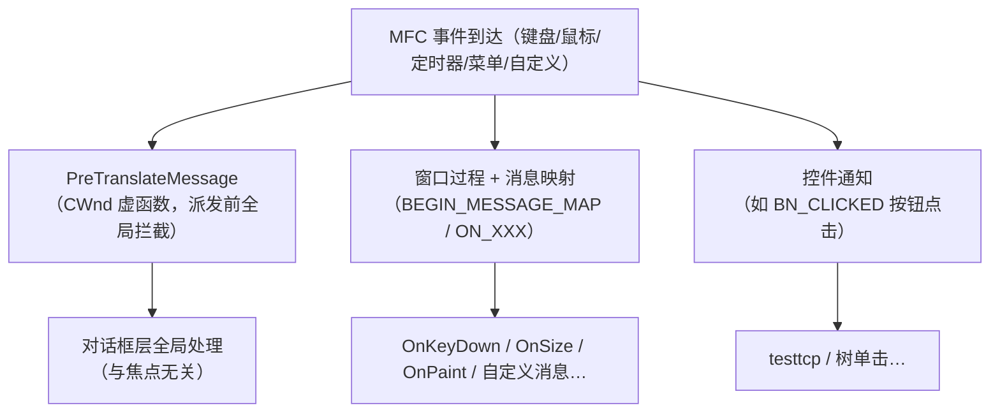

# MFC 基础机制（viewhost 语境）

viewhost（`thirdparty/sync/examples/viewhost`）用到的 MFC 基础机制。项目背景见 [viewhost设计.md](../design/viewhost设计.md)。

---

## 1. `.rc` 资源脚本：算源码，但不是 C++

`.rc` 是 Windows **资源定义文件**：声明对话框模板、控件布局、字符串、图标等静态 UI 资源。

| 维度 | C++ 源码（`.h/.cpp`） | 资源脚本（`.rc`） |
|------|------|------|
| 编译器 | cl / clang++ | **rc.exe**（资源编译器） |
| 产物 | `.obj` → 链接 | `.res` → 链接 |

- 参与构建与版本管理，**是工程源码的一部分**，只是语言不是 C++。
- clang 不处理 `.rc` → 这也是 MFC 必须用 MSVC 编译的原因之一。

### 1.1 两种按钮：`DEFPUSHBUTTON` vs `PUSHBUTTON`

| 控件 | 含义 | 按 Enter 行为 |
|------|------|------|
| `DEFPUSHBUTTON` | **默认按钮**（粗边框） | 对话框内按 Enter 激活它 |
| `PUSHBUTTON` | 普通按钮 | 需鼠标/聚焦+空格 |

- 每个对话框**最多一个默认按钮**；按 Enter 会转成对默认按钮的点击。
- viewhost 主表单不再放退出按钮；关进程走框架菜单「文件 → 退出」或标题栏关闭。属性面板仍是普通 `CDialog`。

---

## 2. 启动序列：`m_pMainWnd` + `LoadFrame` + `Run()`

```cpp
m_pMainWnd = frame;
frame->LoadFrame(IDR_MAINFRAME);
frame->ShowWindow(SW_SHOW);
return TRUE;   // 继续 CWinApp::Run()，非模态
```

- `CWinAppEx::InitInstance` 返回 TRUE 后进入应用消息循环；关主框架后 `Run` 返回，进程退出。
- `CWinAppEx` 默认会从注册表恢复主窗口尺寸（`EnableLoadWindowPlacement`）。viewhost 主客户区是固定 DLU 的 `CFormView`，恢复会留下一圈空白；已关掉恢复，并在 `LoadFrame` 之后按表单 `GetTotalSize()` 收外框。
- 命令行有焦点时 Enter 发 `CigiSymbolTextDefV4`（在 `PreTranslateMessage` 里拦，避免 `IsDialogMessage` 当成默认按钮）。
- 旧路径是 `CDialog::DoModal()`（`RunModalLoop` 阻塞在 `InitInstance` 里，返回 FALSE 退出）。属性面板仍用 `DoModal()`。

---

## 3. `OnOK` / `OnCancel`：属性对话框仍要拦默认关闭

`CDialog` 默认行为：`OnOK`→`EndDialog(IDOK)`、`OnCancel`→`EndDialog(IDCANCEL)`，**都会关对话框**。

- 实体属性面板：`OnOK` 空重载，避免 Enter 未按 Apply 就关；`OnCancel` 仍 `EndDialog`（ESC / 标题栏关闭）。
- 主界面已是 `CFormView`，不再靠空 `OnOK`/`OnCancel` 保命；主表单无默认按钮。命令行 Enter 在 `PreTranslateMessage` 里单独处理，其它位置 Enter 不关进程。

---

## 4. 业务逻辑入口：消息映射 + 虚函数 + PreTranslateMessage

MFC 扩展点分三层：



| 入口 | 触发 | 本程序用途 |
|------|------|------|
| **消息映射 `ON_XXX`** | 窗口/控件/菜单/定时器/自定义消息 | `ON_WM_TIMER`、`ON_BN_CLICKED`、`ON_WM_DESTROY` |
| **覆盖虚函数** | 生命周期钩子 | `OnInitialUpdate`、`OnDestroy`；属性面板 `OnInitDialog` / `OnOK` |
| **`PreTranslateMessage`** | 消息派发前、全局 | 控眼点时吞掉方向键/WASD；鼠标按下时判定进入/退出控制 |
| **自定义消息 `ON_MESSAGE(WM_APP+n)`** | 推迟到下一圈消息循环 / 子对话框回传 | 双击实体后弹属性；Apply 后刷新树 |

---

## 5. 键盘处理：为什么不用 `OnKeyDown`

**消息映射能处理键盘**（`ON_WM_KEYDOWN()` → `OnKeyDown`），但对话框有个坑：

> 焦点在子控件上时，`WM_KEYDOWN` 发给**焦点控件**，对话框收不到 → `OnKeyDown` 常常失效。

解法：`PreTranslateMessage`——在消息派发给任何控件**之前**拦截，对话框内全局生效、与焦点无关。

### 5.1 事件响应 vs 帧轮询（viewhost 的分工）

| 机制 | 语义 | 本程序 |
|------|------|------|
| `PreTranslateMessage` | **按键/鼠标事件**（派发前拦截） | 控眼点时吞相机键；`WM_LBUTTONDOWN` 判定进入/退出 |
| `OnTimer` + `GetAsyncKeyState` | **定时轮询**（每 ~16ms 采样一次） | WASD/CE/方向键 → 持续移动 |

```text
瞬时动作（进入/退出眼点控制）→ 走事件：单击 eyePoint / 单击树上其它项
持续动作（移动）→ 走轮询：每帧读键，按住持续位移
```

- 空格不再切换眼点控制（入口改为场景树单击 `eyePoint`）。
- 移动不是「延迟响应」，是「按帧采样聚合」，与游戏引擎一致。

### 5.2 助记键（`&X`）与操控键的冲突

字母助记键会被 `IsDialogMessage` 直接激活按钮。viewhost 眼点开关不走按钮，故无「开始控制(&S)」与 S=后退的冲突。菜单「退出(&X)」的 X 不与操控键冲突。

---

## 6. `CFrameWndEx` vs `CDialog`

两者都可作主窗口、都用消息映射、都能重写 `PreTranslateMessage`，但属于**两条窗口体系**。

| 维度 | `CDialog` | `CFrameWndEx` |
|------|------|------|
| 窗口本质 | **对话框**：从 `.rc` 模板（`IDD_xxx`）创建 | **框架窗口**：程序化创建 / `LoadFrame`，可调大小、可最大化 |
| 模态 | 通常模态（`DoModal` 阻塞）；也可无模态 | 恒**无模态**，常驻主框架 |
| 内容承载 | **直接放控件**（按钮/文本/编辑框） | **宿主 View**（`CView` 派生）+ 可停靠面板 |
| Doc/View 架构 | 无 | 专为 SDI/MDI 文档-视图设计 |
| 命令路由 | 对话框自行处理 | 命令链：**View → Doc → Frame → App** |
| 菜单/工具栏/状态栏 | 无自动支持 | 自动集成（`CMFCRibbonBar`/`CMFCToolBar`/`CMFCStatusBar` 等） |
| 停靠面板 | 无 | `CPane`/`CDockingManager` 停靠布局 |
| 键盘导航 | `IsDialogMessage`：Tab/助记键/Enter 特殊 | 常规 `WM_KEYDOWN`，`OnKeyDown` 通常可收到 |

**选型**：

| 需求 | 选谁 |
|------|------|
| 工具面板 / 控制台 / 参数配置，且要后续加停靠面板（viewhost） | **`CFrameWndEx` + `CFormView`** |
| 只要一张固定对话框、无扩展计划 | **`CDialog`**（属性面板仍用这个） |
| 大型 MDI 应用 | `CMDIFrameWndEx`（MDI 版） |

一句话：**`CDialog` 是「对话框即窗口」，`CFrameWndEx` 是「框架窗口 + 承载视图/面板」**。

### 6.1 View 与 Pane

在 `CFrameWndEx` 里这两个不是同义词：

| 词 | 基类 | 位置 | 干什么 |
|------|------|------|------|
| **View** | `CView` / `CFormView` | 框架**客户区**（中间那块） | 主工作区。viewhost 用 `CFormView` 放仪表盘 + 场景树 |
| **Pane**（常写成 panel） | `CPane` / `CDockablePane` | 客户区**四周**，可拖、可钉、可关 | 工具侧栏。后续 IG 列表 / 报文 dump / 命令行适合用它 |

- **仪表盘**：主工作区上的状态/控制台面，不是一类 MFC 控件。viewhost 现在是 FormView 右侧「连接状态 / 眼点 / 报文自检」各一行，下面是「IG 连接」列表（id / 状态 / 平均RTT / 最近RTT / 丢包率 / 距上次SOF）和「命令行」（仍在同一张 FormView，还不是停靠 Pane）。
- 左右分栏可以只改 FormView 的 `.rc` 坐标（当前做法），不必先做成真正的停靠 Pane。真 Pane 是独立窗口，有自己的消息映射，树的焦点逻辑要再迁一次。

---

## 7. 一句话总结

| 主题 | 结论 |
|------|------|
| `.rc` | 资源脚本，算源码，rc.exe 编译 |
| 默认按钮 | `DEFPUSHBUTTON` 响应 Enter，每对话框一个 |
| 启动 | 主窗 `LoadFrame` + `Run()`；属性面板仍 `DoModal()` |
| `OnOK/OnCancel` | 属性对话框拦截 Enter 误关；主窗靠框架关闭 |
| 业务入口 | 消息映射 + 虚函数 + `PreTranslateMessage` 三层 |
| 对话框键盘 | 用 `PreTranslateMessage`，不用 `OnKeyDown` |
| 瞬时 vs 持续 | 瞬时动作走事件，持续动作走帧轮询 |
| 助记键 | 字母助记键与操控键冲突则不要用；眼点开关走树单击 |
