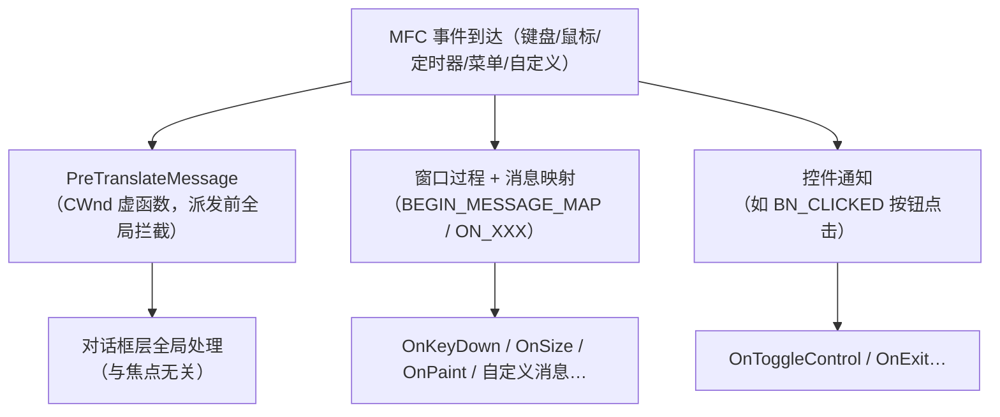

# MFC 基础机制（viewhost 语境）

viewhost（`thirdparty/sync/examples/viewhost`）用到的 MFC 基础机制。项目背景见 [viewhost设计.md](../design/viewhost设计.md)。

---

## 1. `.rc` 资源脚本：算源码，但不是 C++

`.rc` 是 Windows **资源定义文件**：声明对话框模板、控件布局、字符串、图标等静态 UI 资源。

| 维度 | C++ 源码（`.h/.cpp`） | 资源脚本（`.rc`） |
|------|------|------|
| 编译器 | cl / clang++ | **rc.exe**（资源编译器） |
| 产物 | `.obj` → 链接 | `.res` → 链接 |

- 参与构建与版本管理，**是工程源码的一部分**，只是语言不是 C++。
- clang 不处理 `.rc` → 这也是 MFC 必须用 MSVC 编译的原因之一。

### 1.1 两种按钮：`DEFPUSHBUTTON` vs `PUSHBUTTON`

| 控件 | 含义 | 按 Enter 行为 |
|------|------|------|
| `DEFPUSHBUTTON` | **默认按钮**（粗边框） | 对话框内按 Enter 激活它 |
| `PUSHBUTTON` | 普通按钮 | 需鼠标/聚焦+空格 |

- 每个对话框**最多一个默认按钮**；按 Enter 会转成对默认按钮的点击。
- viewhost：「退出」用 `DEFPUSHBUTTON`（Enter 即退出）；「开始控制」用 `PUSHBUTTON`（**避免被 Enter 误触发**切换）。

---

## 2. 启动序列：`m_pMainWnd` + `DoModal()`

```cpp
m_pMainWnd = &dlg;   // 告诉 CWinApp 主窗口是谁（退出/系统消息参照）
dlg.DoModal();       // 进入模态消息循环，阻塞到对话框关闭
```

- `DoModal()` 内部 `RunModalLoop` 自己跑消息循环，对话框开着时 `InitInstance` 卡在这。
- 关闭（`EndDialog`）后返回 → `InitInstance` 返回 FALSE → 程序退出。

---

## 3. `OnOK` / `OnCancel` 空重载：拦截「默认关闭」

`CDialog` 默认行为：`OnOK`→`EndDialog(IDOK)`、`OnCancel`→`EndDialog(IDCANCEL)`，**都会关对话框**。

- 常驻 Host 程序不应被 Enter/ESC 误关 → **必须重写为空**，覆盖默认关闭。
- 不是「必须重载才可用」，而是「必须覆盖默认关闭行为」。
- viewhost 现状：**ESC 安全、Enter 退出**（Enter 走默认按钮 `IDC_EXIT`）。

---

## 4. 业务逻辑入口：消息映射 + 虚函数 + PreTranslateMessage

MFC 扩展点分三层：



| 入口 | 触发 | 本程序用途 |
|------|------|------|
| **消息映射 `ON_XXX`** | 窗口/控件/菜单/定时器/自定义消息 | `ON_WM_TIMER`、`ON_BN_CLICKED`、`ON_WM_DESTROY` |
| **覆盖虚函数** | 生命周期钩子 | `OnInitDialog`、`OnDestroy`、`OnOK/OnCancel` |
| **`PreTranslateMessage`** | 消息派发前、全局 | 空格切换控制 |
| **自定义消息 `ON_MESSAGE(WM_APP+n)`** | 工作线程→UI 线程 | 高节拍方案的工作线程回传状态 |

---

## 5. 键盘处理：为什么不用 `OnKeyDown`

**消息映射能处理键盘**（`ON_WM_KEYDOWN()` → `OnKeyDown`），但对话框有个坑：

> 焦点在子控件上时，`WM_KEYDOWN` 发给**焦点控件**，对话框收不到 → `OnKeyDown` 常常失效。

解法：`PreTranslateMessage`——在消息派发给任何控件**之前**拦截，对话框内全局生效、与焦点无关。

### 5.1 事件响应 vs 帧轮询（viewhost 的分工）

| 机制 | 语义 | 本程序 |
|------|------|------|
| `PreTranslateMessage` | **按键事件**（边缘触发，下一次消息循环即处理） | 空格 → 切换控制（瞬时动作） |
| `OnTimer` + `GetAsyncKeyState` | **定时轮询**（每 ~16ms 采样一次） | WASD/CE/方向键 → 持续移动 |

```text
瞬时动作（切换）→ 走事件：按一下，立刻切换
持续动作（移动）→ 走轮询：每帧读键，按住持续位移
```

- 空格「立即」是相对 16ms 帧而言，本质仍是消息队列调度，非绝对实时。
- 移动不是「延迟响应」，是「按帧采样聚合」，与游戏引擎一致。

### 5.2 助记键（`&X`）与操控键的冲突

`"开始控制(&S)"` 把 **S 声明为按钮助记键**：焦点不在文本框时直接按 S 会**激活按钮**（切换控制），与「S=后退」冲突。

→ **修复**：toggle 按钮去助记键（纯文字），键盘切换改用空格热键（`PreTranslateMessage` 拦截 `VK_SPACE`，`return TRUE` 吞掉消息避免按钮二次消费）。`退出(&X)` 保留（X 不与操控键冲突）。

---

## 6. `CFrameWndEx` vs `CDialog`

两者都可作主窗口、都用消息映射、都能重写 `PreTranslateMessage`，但属于**两条窗口体系**。

| 维度 | `CDialog` | `CFrameWndEx` |
|------|------|------|
| 窗口本质 | **对话框**：从 `.rc` 模板（`IDD_xxx`）创建 | **框架窗口**：程序化创建 / `LoadFrame`，可调大小、可最大化 |
| 模态 | 通常模态（`DoModal` 阻塞）；也可无模态 | 恒**无模态**，常驻主框架 |
| 内容承载 | **直接放控件**（按钮/文本/编辑框） | **宿主 View**（`CView` 派生）+ 可停靠面板 |
| Doc/View 架构 | 无 | 专为 SDI/MDI 文档-视图设计 |
| 命令路由 | 对话框自行处理 | 命令链：**View → Doc → Frame → App** |
| 菜单/工具栏/状态栏 | 无自动支持 | 自动集成（`CMFCRibbonBar`/`CMFCToolBar`/`CMFCStatusBar` 等） |
| 停靠面板 | 无 | `CPane`/`CDockingManager` 停靠布局 |
| 键盘导航 | `IsDialogMessage`：Tab/助记键/Enter 特殊 | 常规 `WM_KEYDOWN`，`OnKeyDown` 通常可收到 |

**选型**：

| 需求 | 选谁 |
|------|------|
| 工具面板 / 控制台 / 参数配置（viewhost） | **`CDialog`**（轻量，控件直排） |
| 编辑器 / 查看器，需菜单+工具栏+多视图/停靠面板 | **`CFrameWndEx`**（`CView` 宿主） |
| 大型 MDI 应用 | `CMDIFrameWndEx`（MDI 版） |

一句话：**`CDialog` 是「对话框即窗口」，`CFrameWndEx` 是「框架窗口 + 承载视图/面板」**。

---

## 7. 一句话总结

| 主题 | 结论 |
|------|------|
| `.rc` | 资源脚本，算源码，rc.exe 编译 |
| 默认按钮 | `DEFPUSHBUTTON` 响应 Enter，每对话框一个 |
| 启动 | `m_pMainWnd` 标记主窗 + `DoModal()` 模态循环 |
| `OnOK/OnCancel` | 空重载拦截默认关闭 |
| 业务入口 | 消息映射 + 虚函数 + `PreTranslateMessage` 三层 |
| 对话框键盘 | 用 `PreTranslateMessage`，不用 `OnKeyDown` |
| 瞬时 vs 持续 | 瞬时动作走事件，持续动作走帧轮询 |
| 助记键 | 字母助记键与操控键冲突，去之；热键用空格 |
